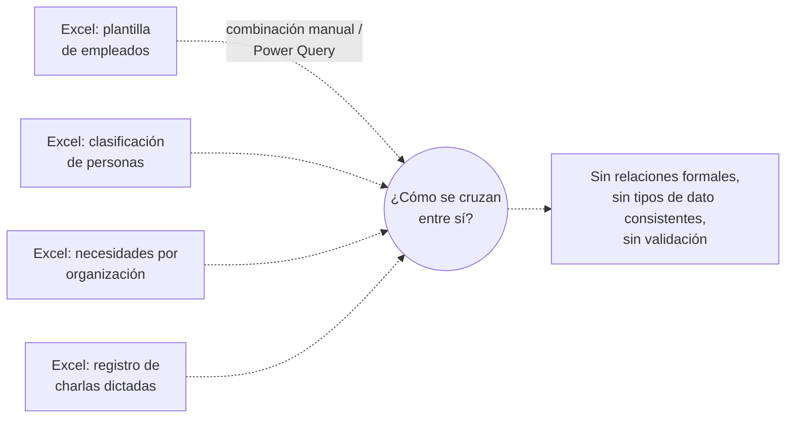
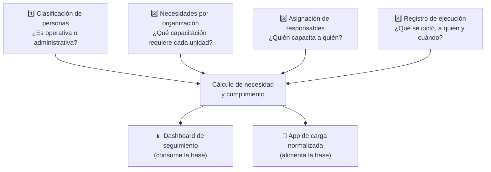
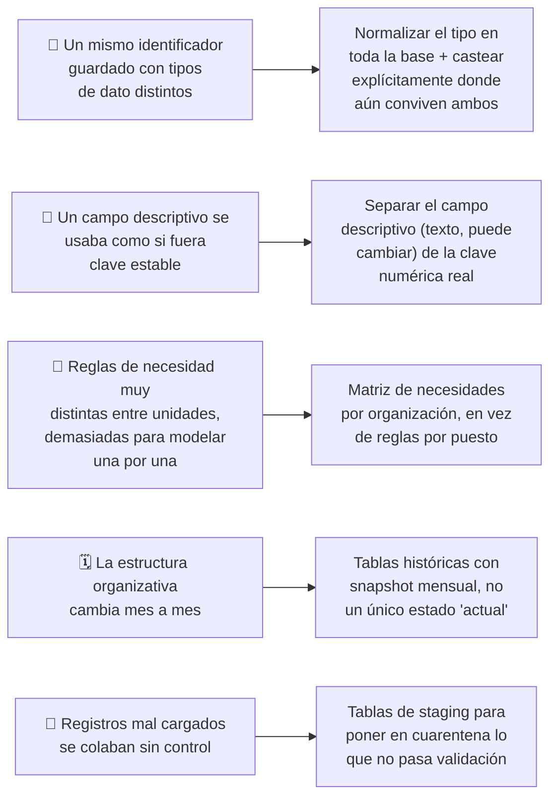
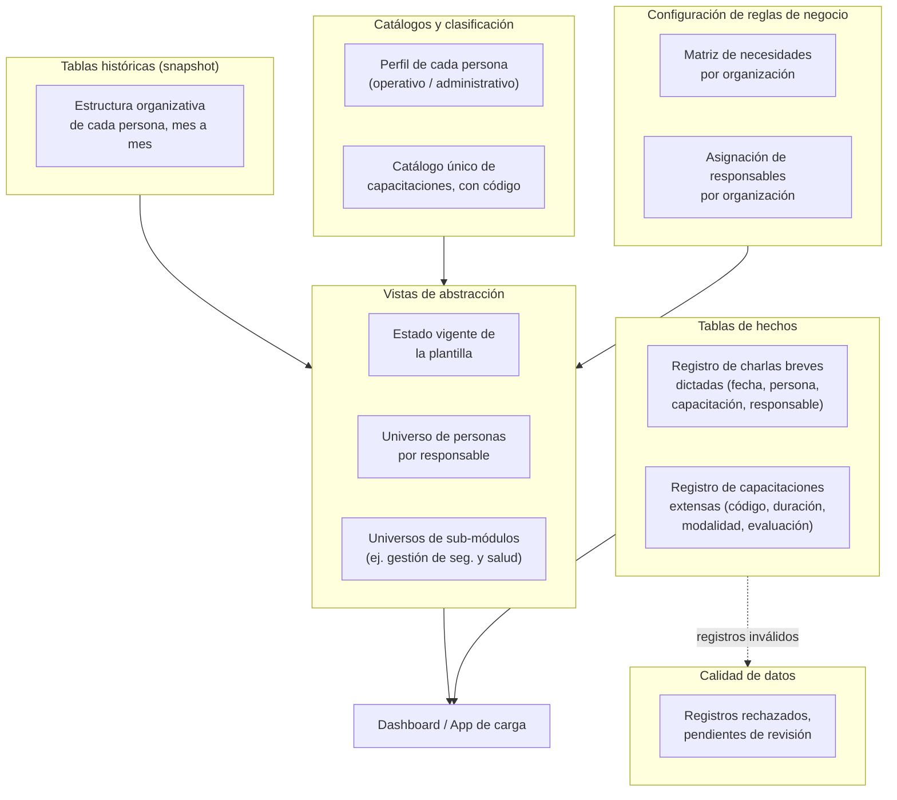

# Capacitaciones.db — Base de Datos Central de Capacitaciones de Seguridad Industrial

README EN PROCESO DE CONSTRUCCIÓN
Ultima modificación: 23/07/2026

## Resumen Ejecutivo

Diseñé y construí la base de datos SQLite que hoy funciona como fuente única de verdad para todo el programa de capacitaciones de seguridad industrial de la empresa. Antes de este proyecto no existía ninguna base de datos: la información vivía repartida en archivos Excel individuales, sin relación formal entre sí.

Esta base de datos es el cimiento sobre el que se apoyan otros dos proyectos que ya documenté por separado en este mismo repositorio:

- **El dashboard de seguimiento** (`charla_5_min`), que es la consulta para calcular y visualizar el cumplimiento de capacitaciones.
- **La aplicación de carga normalizada** (`carga_capacitaciones`), que la alimenta con nuevos registros validados.

Este documento se enfoca en la base de datos en sí: cómo estaba organizada la información antes, qué diseño construí, qué reglas de negocio quedaron modeladas en el esquema, y qué ventajas concretas trajo por sobre trabajar con archivos Excel sueltos.

## Contexto del Problema

### Situación inicial

Toda la información del programa de capacitaciones — quién es cada persona, en qué organización está, qué capacitaciones dictó cada quién y cuándo — vivía en **archivos Excel independientes**, sin ninguna relación formal entre ellos. Cada archivo se mantenía y actualizaba por separado, y para responder cualquier pregunta que cruzara dos fuentes (por ejemplo, "¿esta persona pertenece a una organización que necesita esta capacitación?") había que combinar archivos manualmente, con fórmulas de búsqueda o con Power Query.

### Limitaciones detectadas

- **Sin relaciones formales entre archivos.** Un mismo identificador de persona podía estar guardado como texto en un archivo y como número en otro, lo que obligaba a conversiones manuales propensas a error cada vez que se cruzaba información.
- **Sin historia real.** Los archivos reflejaban, en el mejor de los casos, el estado "actual" de la plantilla. No había una forma sistemática de reconstruir a qué organización pertenecía una persona en un mes específico del pasado.
- **Reglas de negocio dispersas y no auditables.** Qué capacitaciones necesitaba cada organización, o quién era responsable de dictarlas a quién, no estaba modelado en ningún lado de forma explícita — era, en el mejor de los casos, conocimiento informal de quien mantenía cada archivo.
- **Sin capa de validación de calidad.** Cualquier fila mal cargada (un nombre de capacitación mal tipeado, un identificador de persona inexistente) se incorporaba igual al archivo, sin ningún mecanismo que la señalara para revisión.
- **Cero escalabilidad.** Agregar un nuevo tipo de capacitación, una nueva organización, o un nuevo cruce de información implicaba modificar fórmulas y conexiones manualmente en varios archivos a la vez.

### Necesidad identificada

Había que reemplazar ese conjunto de archivos sueltos por una **base de datos relacional real**, que impusiera tipos de dato consistentes, permitiera reconstruir el estado histórico de la plantilla mes a mes, modelara explícitamente las reglas de negocio (qué necesita cada organización, quién es responsable de qué) y ofreciera un mecanismo propio para poner en cuarentena los registros de mala calidad en lugar de incorporarlos sin más.

## Objetivo de Negocio

- Constituir una única fuente de verdad para todo el programa de capacitaciones, reemplazando el conjunto de archivos Excel independientes.
- Normalizar los identificadores clave (por ejemplo, el legajo de una persona) para que tengan un tipo de dato único y consistente en toda la base.
- Modelar explícitamente, en tablas propias, reglas de negocio que antes eran informales: qué necesita cada organización y quién es responsable de capacitar a quién.
- Conservar el histórico mensual de la estructura organizativa, para poder reconstruir el estado de cualquier persona en cualquier período pasado.
- Incorporar un mecanismo de calidad de datos: separar los registros válidos de los que no cumplen el formato esperado, en lugar de aceptar todo sin control.
- Servir como base común para otros sistemas (el dashboard de seguimiento y la aplicación de carga), sin que cada uno tuviera que reinventar su propia fuente de datos.

## Arquitectura General

El modelo de datos se organiza en cuatro dominios lógicos, cada uno resolviendo una pregunta de negocio distinta:

**Capas del esquema:**

- **Tablas de hechos (fact tables):** registran eventos — cada capacitación dictada, a quién, cuándo y por quién. Son tablas que solo crecen con el tiempo, nunca se actualizan retroactivamente.
- **Tablas históricas con snapshot:** conservan una fotografía mensual de la estructura organizativa de cada persona, para poder reconstruir su situación en cualquier período pasado, no solo la actual.
- **Tablas de catálogo y clasificación:** definen qué es cada cosa — el perfil de una persona, el catálogo oficial de capacitaciones con su código único.
- **Tablas de configuración de reglas de negocio:** la matriz de qué organización necesita qué capacitación, y la asignación de responsables por organización.
- **Tablas de calidad (staging):** almacenan los registros que no pasaron la validación de carga, para su revisión posterior en lugar de descartarlos silenciosamente o aceptarlos sin control.
- **Vistas SQL:** encapsulan las combinaciones de tablas más usadas (por ejemplo, "estado vigente de la plantilla" o "universo de personas de un responsable"), para que el resto del sistema no tenga que repetir esa lógica de cruce en cada consulta.

## Tecnologías Utilizadas

| Tecnología | Propósito |
|---|---|
| SQLite | Motor de base de datos relacional embebido, sin necesidad de un servidor dedicado. |
| SQL (DDL / DML / Vistas) | Definición del esquema, escritura de vistas de abstracción y consultas de migración. |
| Python | Scripts de migración y validación de datos desde los archivos de origen hacia la base. |
| Pandas | Limpieza y transformación de los datos de origen antes de insertarlos. |
| GitHub | Versionado y documentación del esquema (este caso de estudio y el DDL general). |

## Principales Desafíos

- **Identificadores con tipos de dato inconsistentes entre tablas.** El identificador de persona llegaba, según la fuente, unas veces como texto y otras como número. Esto obligaba a decisiones explícitas de conversión (`CAST`) en cada combinación de tablas que lo necesitara, y a documentar claramente en qué tabla el campo es de qué tipo, para que nadie asuma lo contrario al escribir una consulta nueva.
- **Un campo descriptivo usado, por error, como si fuera una clave.** Existía un campo de texto que describe la unidad de pertenencia de una persona, pero ese texto podía variar (redactarse distinto) aunque la unidad real fuera la misma. Tuve que identificar y documentar cuál era la clave numérica estable a usar en su lugar para cualquier agrupación o cruce, dejando el campo de texto solo para mostrarlo en pantalla, nunca para relacionar tablas.
- **Modelar la necesidad de capacitación por organización, no por persona.** Mantener una regla distinta por cada puesto de trabajo era inviable dada la cantidad de combinaciones posibles. La solución fue una matriz (organización × capacitación) con un valor binario que indica si esa unidad necesita esa capacitación — una única fuente de reglas, más fácil de mantener y de auditar que cientos de reglas individuales.
- **Reconstruir el estado histórico, no solo el actual.** Las personas cambian de organización y de perfil mes a mes. Modelé la plantilla como una tabla de snapshots mensuales (una fila por persona y por período), de forma que el estado "vigente" es simplemente el período más reciente, pero el histórico completo queda disponible para reconstruir cualquier cálculo retroactivo.
- **Calidad de los datos migrados.** Al migrar el historial acumulado durante años aparecieron registros con nombres de capacitación mal escritos, duplicados o inconsistentes con el catálogo oficial. En vez de descartarlos o forzarlos a entrar, diseñé tablas de staging que reciben esos registros por separado, para poder auditarlos y corregirlos sin perder trazabilidad de qué falló y por qué.

## Solución Implementada

### El esquema en capas

- **Tablas de hechos:** una para las capacitaciones breves ("charlas de 5 minutos") y otra, en paralelo, para capacitaciones de mayor duración — cada una con su propia estructura, porque registran información distinta (una charla breve no tiene "modalidad" ni "evaluación", por ejemplo).
- **Tabla histórica de plantilla:** una fila por persona y por período, con la unidad organizativa vigente en ese momento. El estado "actual" se obtiene siempre tomando el período más reciente, sin necesidad de una tabla separada para eso.
- **Catálogos:** el perfil de cada persona (qué la clasifica como operativa o administrativa) y el catálogo único de capacitaciones, cada una con un código propio — pensado para que cargar una capacitación nueva implique elegirla de una lista cerrada, no escribir su nombre a mano.
- **Configuración de reglas de negocio:** la matriz de necesidades por organización y la tabla de asignación de responsables — ambas pensadas para que una regla de negocio compleja (quién necesita qué, quién es responsable de quién) se pueda consultar con una sola lectura de tabla, en vez de estar dispersa en fórmulas.
- **Vistas de abstracción:** encapsulan las combinaciones más usadas, para que el dashboard y otros consumidores no tengan que repetir la lógica de cruce (por ejemplo, combinar plantilla + clasificación + matriz de necesidades) en cada consulta.
- **Tablas de staging:** reciben los registros que no pasan la validación de formato al momento de la carga, sin bloquear el resto del proceso ni perder el dato — quedan disponibles para revisión y corrección posterior.

### Ventajas concretas sobre trabajar con archivos Excel sueltos

| Antes (archivos Excel independientes) | Ahora (base de datos normalizada) |
|---|---|
| Identificadores con tipos de dato inconsistentes entre archivos | Tipos de dato unificados y documentados por tabla |
| Sin relación formal entre archivos; cruces armados a mano cada vez | Relaciones explícitas + vistas que encapsulan los cruces más usados |
| Solo existía el estado "actual"; sin forma sistemática de ver el pasado | Snapshots mensuales; se puede reconstruir cualquier período histórico |
| Reglas de negocio informales, no documentadas en ningún lado | Reglas modeladas en tablas propias, consultables y auditables |
| Registros mal cargados se mezclaban con los válidos, sin aviso | Tablas de staging separan lo válido de lo dudoso, sin perder trazabilidad |
| Cada consumidor de la información arma su propio cruce desde cero | Una única base sirve como fuente común para todos los sistemas que la consultan |

## Resultados Obtenidos

- Se estableció, por primera vez, una **fuente única de verdad** para todo el programa de capacitaciones, reemplazando el conjunto de archivos Excel independientes que existía antes.
- El proceso de migración y normalización permitió **detectar errores de carga acumulados durante años** (nombres de capacitación mal escritos, registros duplicados) que antes pasaban completamente inadvertidos.
- La base quedó diseñada para **servir a más de un consumidor**: hoy alimenta tanto un dashboard de seguimiento como una aplicación de carga de datos, sin que ninguno de los dos tenga que mantener su propia copia de la información.
- Se documentaron explícitamente reglas de negocio (necesidades por organización, asignación de responsables) que antes existían solo como conocimiento informal disperso entre distintas personas.

## Lecciones Aprendidas

| Tipo | Aprendizaje |
|---|---|
| Técnica | Cuando un identificador conviene con más de un tipo de dato entre fuentes, conviene normalizarlo cuanto antes; documentar dónde hace falta un `CAST` no reemplaza corregirlo en la fuente. |
| Técnica | Un campo de texto descriptivo nunca debería usarse como clave para relacionar tablas, aunque "en la práctica" identifique lo mismo — su valor puede cambiar sin que cambie lo que representa. |
| Diseño | Modelar reglas de negocio como una matriz o tabla de configuración (en vez de código o fórmulas dispersas) las hace auditables por cualquier persona, no solo por quien las escribió. |
| Diseño | Separar "lo que no pasa validación" en tablas de staging, en vez de rechazarlo sin dejar rastro, es lo que permite auditar errores de carga después, sin perder el dato original. |
| Gestión | Diseñar la base pensando en más de un consumidor desde el principio (dashboard y app de carga) evitó que cada sistema mantuviera su propia copia parcial de la verdad. |

## Próximos Pasos

- [ ] Completar la documentación de la tabla de asignación de responsables por organización.
- [ ] Evaluar migrar la matriz de necesidades (organización × capacitación) a un modelo relacional de tabla intermedia si la cantidad de capacitaciones sigue creciendo, en vez de seguir agregando columnas.
- [ ] Incorporar restricciones de integridad referencial explícitas (claves foráneas) donde hoy la relación es solo lógica.
- [ ] Evaluar unificar el modelo de capacitaciones breves y capacitaciones extensas bajo un esquema común, si ambas terminan necesitando los mismos cruces de información.

## Disclaimer

Este caso de estudio describe conceptos, metodologías y decisiones técnicas de diseño de base de datos aplicadas en un entorno corporativo.
No se incluyen datos reales, información confidencial, propiedad intelectual, rutas de servidores internos ni detalles sensibles de la organización donde fue desarrollado.
