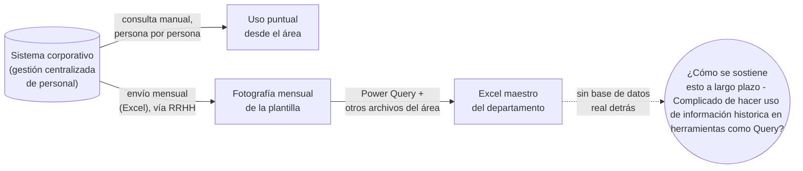
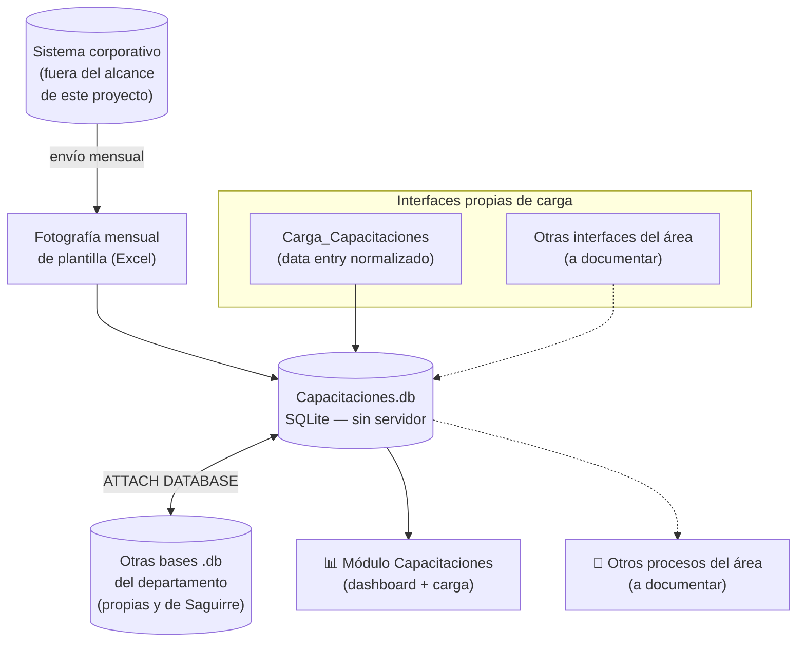
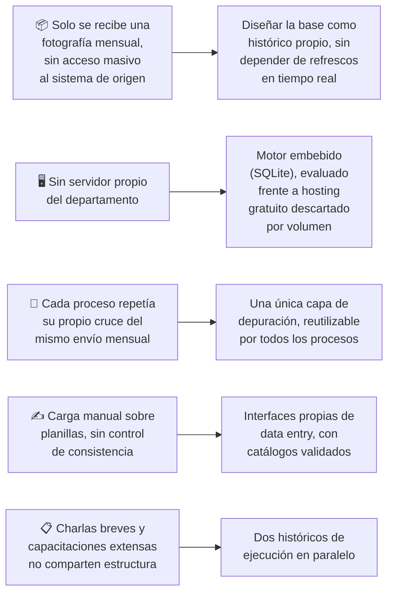

# Capacitaciones.db — Desarrollo de un Ecosistema de Datos propio.

> **Aclaración de alcance:** lo que se documenta acá es un desarrollo interno del área adonde trabaje y trabajo. **No es la base de datos corporativa de la empresa ni un reemplazo de ella** — es una capa propia del departamento, pensada para poder trabajar con información que la empresa administra en otro sistema, al que el área no tenía forma de acceder de manera masiva.

## Resumen Ejecutivo

La empresa adonde se realizo el trabajo lleva el registro y asignaciones de su personal (identificación, a qué unidad, puesto, localización, etc.) en un sistema corporativo centralizado. El departamento donde estoy situado, no contaba con acceso a ese entorno: en la práctica, solo podía consultarlo persona por persona, de forma manual, sin ninguna vía para extraer información en volumen ni para integrarla de manera programática a los procesos propios del área. Para cubrir esa brecha, Recursos Humanos enviaba mensualmente un archivo Excel con una fotografía del estado de la plantilla en ese momento, que después se cruzaba a mano con otros archivos del departamento mediante Power Query.

De esa limitación nace este proyecto: una base de datos **propia del departamento** — no de la empresa — construida en SQLite, que toma ese envío mensual, lo depura y lo convierte en un histórico consultable. La decisión de trabajar con SQLite no fue casual: el departamento no dispone de un servidor propio, así que se evaluó la posibilidad de alojar una base con servidor en algún servicio gratuito, pero el volumen de información que maneja el área a lo largo del tiempo hacía inviable esa alternativa dentro de los límites gratuitos disponibles. SQLite, al ser un motor embebido y sin servidor, resolvió esa restricción sin sacrificar la posibilidad de tener una base relacional real.

Aunque el disparador inicial fue el seguimiento de capacitaciones que dicta el departamento a los empleados de la empresa, esta base terminó funcionando como la columna vertebral de datos de personal para varios procesos del departamento. Hoy conviven varios archivos `.db` independientes — algunos armados por mí y otros por un compañero del área  que se combinan entre sí mediante `ATTACH DATABASE` según lo que necesite cada consulta o cada herramienta puntual. Este documento se enfoca en el módulo de capacitaciones, que es el más maduro, pero el mismo patrón de trabajo se repite en otros procesos del área que iré documentando por separado a medida que estén en condiciones de compartirse.

## Contexto del Problema

### Un dato que existía, pero al que no podíamos llegar a escala

La información de plantilla — unidad de pertenencia, categoría, otros atributos de revista — vivía en un sistema corporativo centralizado. El acceso del departamento a ese sistema era de consulta puntual: buscar a una persona a la vez, sin posibilidad de extraer un volumen de registros ni de automatizar nada sobre esa fuente.

El único canal disponible para trabajar con la plantilla completa era, entonces, ese envío mensual — una foto fija — que luego se mezclaba de forma manual con otros insumos propios del departamento.

### Restricciones que arrastraba este esquema

- **Ningún acceso masivo a la fuente original.** Todo análisis que necesitara la plantilla completa quedaba atado a ese archivo mensual, sin posibilidad de refrescarlo antes del siguiente envío.
- **Sin memoria de los meses anteriores.** Un archivo nuevo reemplazaba al anterior dentro de power query, si bien los historicos existian en formato Excel, vivian como archivos aparte que no se podian utilizar para hacer trazabilidad de nada, se tenian que consultar individualmente, sin una estructura que permitiera consultarlo de forma unificada junto con el resto.
- **Sin trazabilidad de las capacitaciones.** No era dinamico, para saber a que unidad estaba asignado ese empleado cuando recibio la capacitación habia que manualmente ver la fecha que recibio la capacitación y buscar en el archivo de Excel individual de esa fecha para ver.
- **Gran Lentitud en Power Query** Al ser tan extenso el volumen de historico de las capacitaciones, archivos como charlas-5-min referenciado dentro del portafolio, tardaban gran tiempo en poder implementar logicas nuevas, mantener o hacer consultas.
- **Modelo de información basico** El modelo de la información al ser a traves de Power Query era muy basico, no se podia depurar la información comodamente para poder hacer analisis de datos real. Cada sistema dependia de otro y generaba gran molestia actualizarlo o desarrollar tableros debido a que todo acudia a distintos excels pasaban por power query para salir de excel y capaz dirigirse a un Power BI. La cadena estaba saturadisima y arrojaba multiples errores.

### Qué hacía falta

Una base propia del departamento, sin dependencia de servidor, que absorbiera esa fotografía mensual y la transformara en un histórico confiable — y que, además, sirviera como fuente común para los distintos procesos del área, en lugar de que cada uno mantuviera su propia copia parcial de lo mismo.

## Objetivo de Negocio

- Construir una base de datos propia del departamento — explícitamente no la corporativa — que absorba el envío mensual de plantilla y lo convierta en un histórico estructurado.
- Resolver esa necesidad sin infraestructura de servidor propia, aprovechando un motor embebido que pudiera vivir en la misma red de archivos que ya usa el área.
- Depurar esa información una sola vez para que los distintos procesos internos la consuman desde el mismo lugar, en vez de reconstruir el cruce cada uno por su cuenta.
- Dar a los integrantes del departamento una forma de cargar información nueva sin necesidad de tocar la base directamente ni de escribir SQL, evitando así los errores de carga típicos de trabajar sobre planillas sueltas.
- Modelar en tablas propias las reglas específicas de capacitaciones: qué necesita cada unidad, quién es responsable de dictarlas.
- Distinguir y registrar por separado las capacitaciones breves ("charlas de seguridad") de las capacitaciones extensas con evaluación, dado que tienen atributos y ciclos de vigencia distintos.

## Arquitectura General

**En criollo, qué resuelve esta capa:** no reemplaza al sistema corporativo, lo complementa. Toma lo único que el departamento puede recibir de ese sistema — la fotografía mensual — y construye, a partir de eso, un histórico propio, sin necesitar un servidor que el área no tiene, y reutilizable por más de un proceso interno.

**Cómo está organizada la información:**

- **Histórico de plantilla:** una fotografía por persona y por mes, tal como llega el envío mensual, pero consultable de forma unificada, con el estado vigente siempre disponible como "el mes más reciente".
- **Clasificación de personas:** el perfil de cada persona dentro del programa de capacitaciones.
- **Reglas propias del proceso:** qué necesita cada unidad y quién es responsable de dictarlo — información que no viene de ninguna fuente externa, sino que se define y mantiene dentro del departamento.
- **Dos históricos de ejecución en paralelo:** uno para charlas breves y otro para capacitaciones extensas con evaluación, porque no comparten estructura (una charla no tiene "modalidad" ni "nota", por ejemplo).
- **Vistas de abstracción:** encapsulan los cruces más repetidos (estado vigente de plantilla, universo de un responsable, etc.) para que ningún proceso tenga que reconstruir esa lógica desde cero.

**Un matiz sobre el estado actual:** el histórico de capacitaciones extensas con evaluación ya vive dentro de esta base, pero todavía **no está integrado al tablero visual** de seguimiento — se consulta por otra vía. Es trabajo pendiente de unificación, no una limitación del diseño.

### Un ecosistema de bases, no una sola

`Capacitaciones.db` no vive aislada. El departamento fue armando, con el tiempo, distintos archivos `.db` independientes — cada uno resolviendo una necesidad puntual, algunos de mi autoría y otros de Saguirre — que se combinan entre sí según lo requiera cada consulta o cada herramienta, usando `ATTACH DATABASE` para leer de más de una base en la misma sesión sin duplicar información entre ellas. Este patrón permitió que cada base creciera de forma independiente, sin forzar todo a vivir en un único archivo monolítico, manteniendo igual la posibilidad de cruzar información entre bases cuando hace falta.

### Interfaces de carga: normalizar el dato antes de que entre

Tener una base bien diseñada no alcanza si la forma de cargar información sigue siendo una planilla suelta. Por eso, en paralelo a la base, se fueron desarrollando pequeñas aplicaciones de escritorio pensadas para que el personal del departamento pueda ingresar información nueva sin escribir una sola línea de SQL y sin margen para los errores típicos de tipeo libre. `Carga_Capacitaciones` es la primera de esas interfaces: una pantalla simple donde cargar una charla o capacitación dictada, con los valores ya validados contra los catálogos de la base, así que lo que entra ya llega normalizado. Existen otras herramientas del mismo estilo para otros procesos del área, que se irán documentando como casos de estudio independientes a medida que estén listas para compartirse.

## Tecnologías Utilizadas

| Tecnología | Propósito |
|---|---|
| SQLite | Motor de base de datos relacional embebido y sin servidor — elegido, entre otras razones, porque el departamento no cuenta con infraestructura propia para alojar una base tradicional. |
| SQL (DDL / DML / Vistas) | Definición del esquema y de las vistas de abstracción sobre los cruces más frecuentes. |
| `ATTACH DATABASE` | Mecanismo para combinar, dentro de una misma sesión, información que vive repartida en distintos archivos `.db` del departamento. |
| Python | Scripts de migración y depuración de la fotografía mensual antes de incorporarla a la base, y motor de las interfaces de carga de datos. |
| Pandas | Limpieza y transformación de los datos de origen. |
| Excel + Power Query | Formato en el que se recibe la fotografía mensual desde RRHH — fuente externa, fuera del control del departamento. |
| GitHub | Versionado y documentación del esquema. |

## Principales Desafíos

- **Trabajar con una fuente que no podíamos refrescar a demanda.** Sin acceso masivo al sistema corporativo, la base se diseñó asumiendo que la plantilla es, por naturaleza, un dato que llega una vez por mes, en vez de intentar simular algo en tiempo real que no estaba disponible.
- **No contar con servidor propio del área.** Se llegó a evaluar la posibilidad de alojar una base con servidor en algún servicio gratuito, pero el volumen de información que el departamento acumula con el tiempo excedía cómodamente los límites de esas opciones gratuitas. SQLite resolvió el problema sin requerir infraestructura adicional, a costa de renunciar a funciones propias de un motor cliente-servidor — una decisión consciente, no una limitación no evaluada.
- **Evitar que cada proceso reinventara su propio cruce.** Depurar la plantilla una sola vez, dentro de esta base, evitó que capacitaciones y los demás procesos del área terminaran con versiones distintas de la misma información.
- **Que cargar datos no fuera una fuente de errores en sí misma.** La solución fue construir interfaces de carga propias, con los valores posibles ya definidos por catálogo, en vez de dejar el ingreso de datos abierto a texto libre.
- **Modelar dos tipos de capacitación con reglas distintas.** Charlas breves y capacitaciones extensas con evaluación no comparten estructura, así que quedaron como dos históricos separados desde el diseño, evitando columnas vacías o forzadas en cualquiera de los dos casos.
- **Necesidades de capacitación heterogéneas entre unidades.** Se resolvió con una configuración a nivel de unidad, consultable como dato y no enterrada en una fórmula.
- **Calidad de los datos heredados.** Al migrar el historial acumulado aparecieron inconsistencias de carga previas (nombres mal escritos, duplicados); se diseñó un mecanismo de cuarentena para poder revisarlas sin perder trazabilidad.

## Solución Implementada

### Una base pensada para más de un proceso

Aunque el primer consumidor formal de esta base es el módulo de capacitaciones, el diseño no asume que sea el único. La capa que depura y organiza el histórico de plantilla es genérica: cualquier otro proceso del área que necesite saber a qué unidad pertenece una persona en determinado período puede apoyarse en la misma base, sin reconstruir esa lógica de nuevo. Procesos como accidentes, auditorías, correspondencia interna o sanciones, hoy resueltos con sus propias bases `.db` independientes, se combinan puntualmente con esta a través de `ATTACH DATABASE` cuando necesitan ese mismo dato de plantilla, en lugar de mantener su propia copia.

### El módulo de capacitaciones, en concreto

Dentro de esta base conviven:

- El histórico de charlas de seguridad dictadas (fecha, persona, capacitación, responsable).
- El histórico de capacitaciones extensas con evaluación (que además registra duración, modalidad y nota).
- La configuración de qué necesita cada unidad y quién es responsable de capacitarla.
- Vistas que combinan esta información con el estado vigente de la plantilla, para calcular necesidad y cumplimiento sin repetir la lógica de cruce en cada consulta.

Solo el histórico de charlas breves alimenta hoy el tablero visual de seguimiento; el de capacitaciones extensas queda disponible en la base pero se consulta por otro medio, a la espera de integrarse al mismo dashboard más adelante.

### Cómo entra la información nueva

La carga de charlas y capacitaciones no se hace escribiendo directamente sobre la base ni sobre una planilla suelta. `Carga_Capacitaciones` — una de las interfaces mencionadas más arriba — es el punto de entrada pensado para que cualquier integrante del área pueda registrar una charla dictada eligiendo entre valores ya validados (persona, tipo de capacitación, responsable), en vez de tipear texto libre. Eso resuelve, de entrada, buena parte de los problemas de normalización que antes había que corregir después, en la etapa de depuración.

## Resultados Obtenidos

- Se dejó de depender exclusivamente de consultas manuales, persona por persona, contra el sistema corporativo, para cualquier análisis que necesitara ver la plantilla completa.
- La fotografía mensual, antes combinada a mano con Power Query, ahora se depura una sola vez y queda disponible como histórico estructurado y consultable.
- Se resolvió la necesidad de una base relacional sin depender de un servidor que el departamento no tiene, tras descartar por volumen las alternativas de hosting gratuito evaluadas.
- Se sentó una base común pensada para más de un proceso interno, evitando que cada necesidad futura reconstruya su propio cruce con la información de plantilla desde cero.
- Se redujeron los errores de carga al reemplazar el ingreso manual sobre planillas por interfaces con catálogos validados.
- El proceso de depuración permitió detectar errores de carga heredados que antes pasaban inadvertidos.

## Lecciones Aprendidas

| Tipo | Aprendizaje |
|---|---|
| Técnica | Cuando la fuente externa solo se puede recibir como una fotografía periódica, conviene diseñar el histórico propio alrededor de esa cadencia, en vez de simular algo que la fuente no ofrece. |
| Técnica | No tener servidor propio no es necesariamente un impedimento: un motor embebido puede sostener una base relacional completa siempre que el volumen de datos sea compatible con esa elección. |
| Arquitectura | Repartir la información en varias bases `.db` independientes, combinadas por demanda con `ATTACH DATABASE`, permite que cada una evolucione a su ritmo sin forzar un único archivo monolítico. |
| Diseño | Construir una capa de depuración común, en vez de que cada proceso resuelva su propio cruce, evita que dos áreas del mismo departamento terminen con números distintos para la misma pregunta. |
| Diseño | El punto más eficaz para evitar errores de carga es la interfaz de entrada, no la corrección posterior: validar contra catálogo al momento de cargar ahorra trabajo de depuración más adelante. |
| Gestión | Diseñar pensando en más de un consumidor desde el principio deja la puerta abierta a extender la base a otros procesos sin rediseñarla de nuevo. |

## Próximos Pasos

- [ ] Integrar el histórico de capacitaciones extensas con evaluación al mismo tablero visual que hoy solo muestra charlas breves.
- [ ] Documentar como casos de estudio independientes las demás bases `.db` del departamento y las interfaces de carga asociadas, a medida que estén en condiciones de compartirse.
- [ ] Evaluar mecanismos de actualización más frecuente de la plantilla, si en algún momento se habilita un canal de acceso distinto al envío mensual.
- [ ] Incorporar restricciones de integridad referencial explícitas donde hoy la relación entre tablas y entre bases es solo lógica.

## Disclaimer

Este caso de estudio describe conceptos, metodologías y decisiones técnicas de diseño de un conjunto de bases de datos **departamentales e internas**, distintas de la base de datos corporativa de la empresa. No se incluyen datos reales, información confidencial, propiedad intelectual, rutas de servidores internos ni detalles sensibles de la organización donde fue desarrollado.
