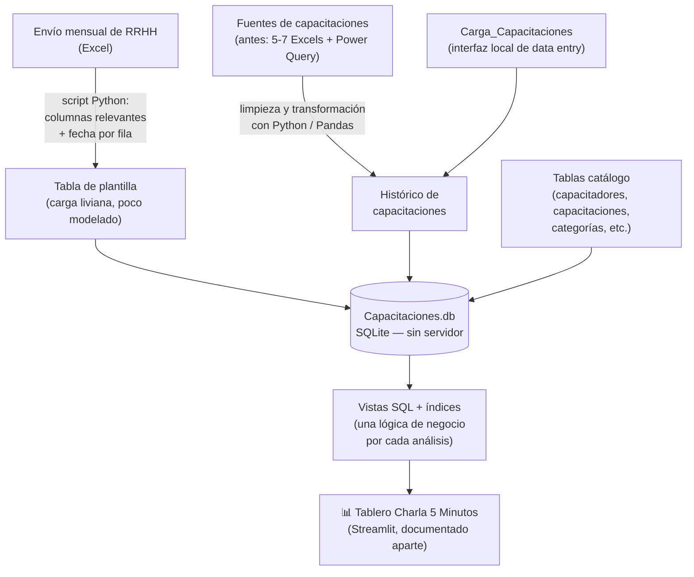
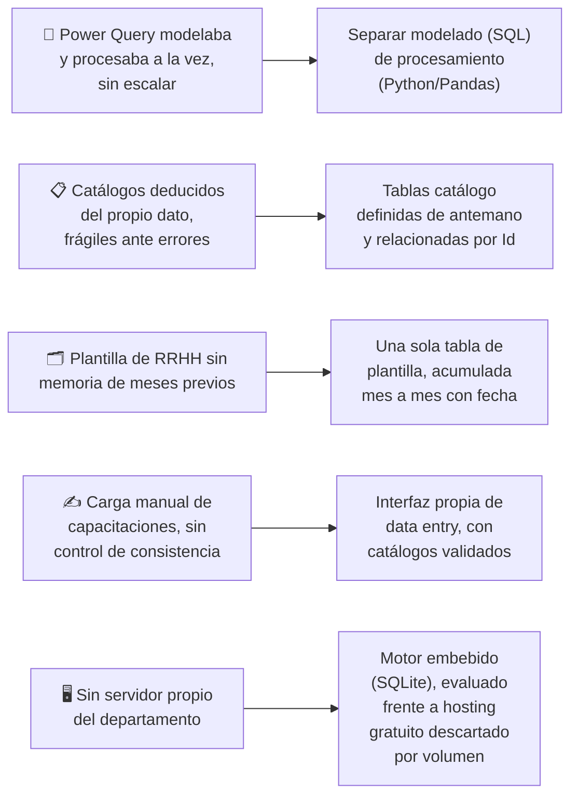

# Capacitaciones.db — Modelar en SQL lo que antes se resolvía a fuerza de Excel y Power Query

> **Aclaración de alcance:** lo que se documenta acá es un desarrollo interno del área donde trabajé y trabajo, dentro de una empresa más grande. **No es la base de datos corporativa de la empresa ni un reemplazo de ella** — es una capa propia del departamento, pensada para procesar y consultar información que antes se resolvía por fuera de cualquier base de datos real.

## De qué se trata este proyecto, antes de entrar en detalle

El departamento donde trabajo dicta y registra dos tipos de actividad formativa de seguridad: **charlas breves** (el programa "Charla 5 Minutos", una charla corta y periódica que se dicta al personal operativo sobre un riesgo puntual de su tarea) y **capacitaciones extensas con evaluación**, de mayor duración. Cada persona pertenece a una unidad organizativa dentro de la empresa, y esa unidad es la que define qué capacitaciones necesita — así que casi cualquier pregunta de gestión termina cruzando tres cosas: la persona, la capacitación, y a qué unidad pertenecía esa persona en el momento en que se dictó.

`Capacitaciones.db` es el proyecto que le dio a esa información una estructura real. No es, en el fondo, un proyecto sobre "los datos de los empleados" — es un proyecto de **modelado de datos**: tomar un proceso que vivía disperso en Excel y Power Query y pasarlo a una base de datos relacional, para que ese tipo de cruces se puedan resolver con una consulta en vez de con horas de trabajo manual. Una vez que la información está bien modelada — con relaciones claras entre las tablas, en vez de fórmulas apiladas — se pueden hacer análisis mucho más finos: cruzar escenarios específicos, filtrar por ventanas de tiempo puntuales, y llegar al detalle de una persona o de una unidad sin tener que reconstruir esa lógica cada vez desde cero.

Un ejemplo real ilustra bien esto. En un momento me consultaron por una capacitación específica: qué personas de una unidad puntual la habían recibido dentro de una franja de fechas determinada. Para responder eso hacía falta reconstruir quién pertenecía a esa unidad durante ese período (no necesariamente quién pertenece hoy), cruzar eso contra el historial de capacitaciones dictadas en esa misma ventana de tiempo, y así identificar tanto a quienes sí la habían recibido como a quienes, perteneciendo a esa unidad en ese momento, no la habían recibido. Con la base ya modelada, esa consulta se resolvió con un cruce (`JOIN`) entre el histórico de plantilla y el histórico de capacitaciones, en cuestión de segundos.

Y acá va la aclaración importante, porque es central para entender qué resuelve realmente este proyecto: **esa consulta siempre se pudo hacer.** No es que antes fuera imposible — con Power Query hubiera llevado bastante más tiempo, y hecha completamente a mano (abriendo Excels de distintos meses y cruzando uno por uno) podía perfectamente la mitad de una jornada de trabajo completa. La base de datos no habilitó un análisis nuevo: lo que hizo fue bajar el costo de responder ese tipo de pregunta de "media jornada" a "segundos", gracias a que la información está modelada correctamente de base. Esa es la ventaja real de este proyecto: claridad y velocidad, no capacidades que no existieran antes.

## Resumen Ejecutivo

`Capacitaciones.db` es una base **SQLite propia del departamento** — no la base corporativa de la empresa — que centraliza el histórico completo de charlas y capacitaciones dictadas, entre otras cosas, junto con el historico de empleados, que cuenta con la información necesaria para saber a qué unidad pertenecía cada persona en cada momento. El proyecto se apoya en una decisión de diseño central: separar el **modelado** de los datos del **procesamiento** de los datos. El modelado — qué tablas existen, cómo se relacionan, qué es catálogo y qué es histórico — vive en SQL. Logica de negocio especifica se resuelve aparte, con Python y Pandas.

Un punto central del modelo son las **tablas catálogo**: cinco o seis tablas que existen únicamente para identificar de forma unívoca entidades que se repiten en todo el histórico (por ejemplo, cada capacitador que pasó por el área, cada tipo de capacitación), cada una con su propio Id. Al estar el resto de la base relacionada con esos catálogos por Id, corregir o completar un dato faltante se hace una sola vez, en un solo lugar, y se refleja automáticamente en todo el histórico relacionado — en vez de tener que salir a buscarlo y reemplazarlo manualmente en decenas de miles de filas.

Sobre esa estructura se construyeron además **vistas SQL con índices**, cada una resolviendo la lógica de un análisis puntual pero masivo y reiterativo (avance por unidad, universo de un capacitador, cobertura de un sistema de gestión), que hoy alimentan el tablero **Charla 5 Minutos** (documentado por separado como su propio caso de estudio en este portafolio). 
La plantilla que envía Recursos Humanos, en cambio, se carga con un procesamiento deliberadamente liviano — un script simplemente agrega la fecha del envío y la inserta como filas nuevas — porque el peso real del proyecto, y donde vale la pena invertir en modelado, está del lado de las capacitaciones, no de la plantilla.

## Contexto del Problema

### Un histórico que existía, pero estaba mal construido

El histórico de capacitaciones no partía de cero: existía, acumulado en un único Excel de unas 80.000 filas, alimentado por entre 5 y 7 archivos Excel individuales que se combinaban mediante Power Query. El problema no era la falta de historial — el problema era cómo estaba construido ese proceso.

```mermaid
flowchart LR
    E1["5 a 7 Excels<br/>individuales de origen"] -->|"Power Query intenta<br/>combinar Y modelar<br/>al mismo tiempo"| HIST["Excel histórico único<br/>(~80.000 filas)"]
    HIST -->|"catálogos deducidos<br/>del propio dato cargado"| TAB["'Tablero' en Excel"]
    TAB -.-> P(("Lento de mantener,<br/>frágil ante cualquier<br/>dato mal cargado"))
```

### Restricciones concretas que esto generaba

- **Catálogos deducidos del dato, en vez de definidos de antemano.** En lugar de partir de una lista cerrada y válida de capacitaciones existentes, Power Query intentaba construir ese catálogo a partir de lo que ya estaba cargado en los Excels de origen. El resultado era un catálogo tan confiable como el dato más inconsistente que hubiera entrado alguna vez al sistema — bastaba una capacitación mal tipeada para que se propagara como si fuera una categoría más.
- **Modelado y procesamiento mezclados en una misma herramienta.** Power Query no solo combinaba archivos: intentaba también resolver ahí mismo la limpieza y la estructura de la información, dos tareas de naturaleza distinta compitiendo entre sí dentro de una herramienta pensada, ante todo, para combinar planillas.
- **Lentitud creciente con el volumen.** Con varias fuentes de origen y un histórico que ya rondaba las 80.000 filas, cualquier ajuste a esa lógica se volvía cada vez más pesado de aplicar y de mantener.
- **Sin memoria histórica — pero del lado de la plantilla, no de las capacitaciones.** Conviene ser preciso acá: el histórico de capacitaciones sí se conservaba completo en ese Excel único. Lo que no tenía memoria era la plantilla de personal: el envío mensual de RRHH reemplazaba al anterior en cada actualización, sin dejar una estructura que permitiera consultar meses previos de forma unificada.
- **Acceso limitado a la fuente de plantilla.** La información de a qué unidad pertenece cada persona vive en un sistema corporativo centralizado al que el departamento no tenía acceso masivo — solo consulta manual, persona por persona. RRHH cubría esa brecha con el envío mensual mencionado arriba, que era, a su vez, uno de los insumos que alimentaba la cadena de Power Query.

### Qué hacía falta

Separar dos responsabilidades que en el esquema anterior estaban mezcladas dentro de una misma herramienta: por un lado, un modelo de datos correcto, con catálogos definidos de antemano y relaciones explícitas; por otro, un procesamiento de datos real, capaz de limpiar y transformar la información de origen antes de que llegara a esas tablas. En paralelo, había que resolver un problema puntual pero distinto: darle a la plantilla de RRHH la memoria histórica que nunca tuvo.

Más allá de las capacitaciones puntualmente, esto respondía a una necesidad más amplia del departamento. El área genera un volumen de información considerable, repartido entre varios procesos (capacitaciones, y otros que fueron surgiendo con el tiempo), y no es razonable esperar que cada persona del equipo resuelva su porción con su propia lógica de Power Query — incluso si así se hiciera, relacionar esa información entre distintos procesos sería, en la práctica, muy difícil de sostener. Hacía falta una infraestructura de datos propia del departamento, no una colección de soluciones individuales inconexas entre sí.

## Objetivo de Negocio

- Migrar el modelado del histórico de capacitaciones desde Power Query hacia una base propia en SQLite, con tablas catálogo definidas de antemano en lugar de deducidas sobre la marcha.
- Separar el modelado de datos (SQL) del procesamiento de datos (Python/Pandas), como dos etapas distintas del mismo flujo.
- Sostener un histórico de capacitaciones consultable y trazable, donde cualquier registro se pueda cruzar con la unidad organizativa vigente de esa persona **en el momento en que la capacitación ocurrió**, no solo con su situación actual.
- Dar memoria histórica a la plantilla de RRHH, acumulando cada envío mensual en lugar de reemplazar al anterior.
- Dar soporte, mediante vistas, a un tablero real (Charla 5 Minutos) capaz de responder preguntas de análisis que el esquema anterior no podía sostener con agilidad.
- Dar a los integrantes del departamento una forma de cargar información nueva sin escribir SQL, evitando los errores de carga típicos de trabajar sobre planillas sueltas.
- Sentar una base de datos pensada para más de un proceso del área, no solo para capacitaciones — de forma que otros procesos del departamento puedan apoyarse en la misma infraestructura en vez de resolver cada uno su propia versión aislada.

## Arquitectura General

```mermaid
flowchart TB
    RRHH["Envío mensual de RRHH<br/>(Excel)"] -->|"script Python:<br/>columnas relevantes<br/>+ fecha por fila"| PLANT["Tabla de plantilla<br/>(carga liviana, poco modelado)"]
    ORIG["Fuentes de capacitaciones<br/>(antes: 5-7 Excels + Power Query)"] -->|"limpieza y transformación<br/>con Python / Pandas"| HIST["Histórico de<br/>capacitaciones"]
    CARGA["Carga_Capacitaciones<br/>(interfaz local de data entry)"] --> HIST

    PLANT --> DB[("Capacitaciones.db<br/>SQLite — sin servidor")]
    HIST --> DB
    CAT["Tablas catálogo<br/>(capacitadores, capacitaciones,<br/>categorías, etc.)"] --> DB

    DB --> V["Vistas SQL + índices<br/>(una lógica de negocio<br/>por cada análisis)"]
    V --> DASH["📊 Tablero Charla 5 Minutos<br/>(Streamlit, documentado aparte)"]
```

**Cómo se dividen las responsabilidades:** el modelado — qué tablas existen, cómo se relacionan, qué es catálogo y qué es histórico — se resuelve en SQL. El procesamiento — limpiar texto, unificar formatos, resolver inconsistencias entre las fuentes de origen — se resuelve por fuera, en Python con Pandas, antes de que el dato entre a la base. Esa separación es, en buena medida, lo que el esquema anterior en Power Query no lograba sostener, al intentar resolver ambas cosas a la vez con una herramienta pensada principalmente para combinar planillas.

**Cómo está organizada la información:**

- **Tablas catálogo:** identifican de forma unívoca entidades recurrentes — capacitadores, tipos de capacitación, categorías —, cada una con su Id, relacionadas con el resto de la base por ese Id.
- **Histórico de plantilla:** una fotografía por persona y por mes, cargada casi tal cual llega desde RRHH, con la fecha de esa fotografía como único agregado. El estado vigente queda disponible tomando siempre "el mes más reciente".
- **Histórico de capacitaciones:** el registro real de cada charla o capacitación dictada — fecha, persona, tipo, responsable —, heredado del histórico previo de ~80.000 filas y depurado contra las tablas catálogo antes de incorporarse.
- **Vistas de abstracción con índices:** encapsulan la lógica específica de cada análisis (quién debería estar capacitado, quién ya lo está, avance por unidad o por capacitador), para que el tablero no tenga que reconstruir ese cruce en cada consulta.

**Sobre trabajar con más de una base a la vez:** como metodología de trabajo, cuando una consulta necesita combinar información que vive en distintos archivos `.db` del departamento, se usa `ATTACH DATABASE` de SQLite para leer de más de una base dentro de la misma sesión, sin duplicar información entre ellas. Es más una forma de trabajo que una arquitectura formal: permite que cada base se mantenga y evolucione por separado, y aun así cruzar lógica de una hacia la otra cuando hace falta.

**Cómo entra la información nueva:** la carga de charlas y capacitaciones no se hace escribiendo directamente sobre la base ni sobre una planilla suelta. `Carga_Capacitaciones` — documentada por separado como su propio caso de estudio — es una interfaz local pensada para que cualquier integrante del área registre una charla o capacitación dictada eligiendo entre valores ya validados contra las tablas catálogo, en vez de tipear texto libre. Esa misma información, una vez cargada ahí, es la que después consume el tablero Charla 5 Minutos construido en Streamlit.

## Tecnologías Utilizadas

| Tecnología | Propósito |
|---|---|
| SQLite | Motor de base de datos relacional embebido y sin servidor — el departamento no cuenta con infraestructura propia para alojar una base tradicional. |
| SQL (Tablas catálogo + Vistas + Índices) | El modelado de la información: catálogos definidos de antemano, relaciones explícitas, y vistas que resuelven la lógica de cada análisis del tablero. |
| Python + Pandas | El procesamiento de la información: limpieza y transformación de los datos de origen antes de insertarlos, separado deliberadamente del modelado en SQL. |
| `ATTACH DATABASE` | Metodología para combinar, dentro de una misma sesión, información que vive repartida en distintos archivos `.db` del departamento. |
| Excel + Power Query | Formato en el que llegaba —y llega— la plantilla mensual desde RRHH; el mecanismo que este proyecto reemplaza como motor de modelado del histórico de capacitaciones. |
| GitHub | Versionado y documentación del esquema. |

## Principales Desafíos

```mermaid
flowchart LR
    D1["🐌 Power Query modelaba<br/>y procesaba a la vez,<br/>sin escalar"] --> S1["Separar modelado (SQL)<br/>de procesamiento<br/>(Python/Pandas)"]
    D2["📋 Catálogos deducidos<br/>del propio dato,<br/>frágiles ante errores"] --> S2["Tablas catálogo<br/>definidas de antemano<br/>y relacionadas por Id"]
    D3["🗂️ Plantilla de RRHH sin<br/>memoria de meses previos"] --> S3["Una sola tabla de<br/>plantilla, acumulada<br/>mes a mes con fecha"]
    D4["✍️ Carga manual de<br/>capacitaciones, sin<br/>control de consistencia"] --> S4["Interfaz propia de<br/>data entry, con<br/>catálogos validados"]
    D5["🖥️ Sin servidor propio<br/>del departamento"] --> S5["Motor embebido<br/>(SQLite), evaluado<br/>frente a hosting<br/>gratuito descartado<br/>por volumen"]
```

- **Definir catálogos correctos, en vez de deducirlos del propio dato.** El problema de fondo no era solo de rendimiento: era que se intentaba construir listas de validación a partir de lo que ya estaba cargado, en vez de partir de una lista cerrada y correcta. Resolver esto significó definir tablas catálogo explícitas en SQL, con sus propios Ids, relacionadas con el resto de la base.
- **Separar dos tareas que estaban mezcladas.** Una misma herramienta hacía, a la vez, de motor de modelado y de motor de procesamiento. La solución fue dividir esas responsabilidades: SQL para la estructura, Python y Pandas para la limpieza de los datos de origen antes de insertarlos.
- **Dar memoria histórica a la plantilla de RRHH.** A diferencia del histórico de capacitaciones, que sí existía completo, la plantilla se perdía mes a mes. Se resolvió con una tabla que acumula cada envío, identificado por su fecha.
- **Depurar años de historial disperso.** El histórico previo venía repartido en origen entre 5 y 7 archivos, con inconsistencias de carga heredadas (nombres mal escritos, duplicados). Se diseñó un mecanismo de cuarentena para poder revisarlas sin perder trazabilidad.
- **Que cargar datos no fuera una fuente de errores en sí misma.** La solución fue construir una interfaz de carga propia, con los valores posibles ya definidos por catálogo, en vez de dejar el ingreso de datos abierto a texto libre.
- **No contar con servidor propio del área.** Se evaluó alojar una base con servidor en algún servicio gratuito, pero el volumen de información que el departamento acumula con el tiempo excedía cómodamente los límites de esas opciones. SQLite resolvió el problema sin requerir infraestructura adicional.

## Solución Implementada

### Tablas catálogo: modelar antes de cargar, no deducir después

El cambio de fondo respecto del esquema anterior fue este: en vez de dejar que el catálogo de capacitaciones, capacitadores o categorías se fuera armando implícitamente a partir de lo que ya estaba cargado, se definieron esas listas como tablas propias, con su Id, desde el principio. El histórico de capacitaciones y las demás tablas se relacionan con esos catálogos por ese Id, así que corregir un dato faltante o mal cargado se hace una vez, en el catálogo, y se refleja en todo el histórico relacionado — en vez de salir a buscar y reemplazar manualmente en decenas de miles de filas.

### Modelado en SQL, procesamiento en Python

La estructura relacional — qué tablas existen, cómo se relacionan, qué vistas resuelven qué pregunta — se define y vive en SQL. La limpieza de los datos de origen — normalizar texto, resolver inconsistencias puntuales entre las distintas fuentes que antes convivían en Power Query — se resuelve antes, con Python y Pandas, como una etapa separada. Esta división fue clave para pensar el sistema con escalabilidad desde el inicio, en vez de sobrecargar una sola herramienta con ambas responsabilidades.

### La plantilla de RRHH: carga liviana, a propósito

El envío mensual de RRHH se procesa con un script simple: lee el Excel, selecciona las columnas de interés para el departamento y las inserta como filas nuevas en SQLite, agregando a cada fila la fecha del envío al que corresponde. No hay mayor modelado en este paso, a propósito — el peso real de este proyecto está del lado de las capacitaciones, no de la plantilla, así que este procesamiento se mantuvo deliberadamente simple.

### Un caso real: cruzar unidad, tiempo y capacitación

Vale la pena volver sobre el ejemplo mencionado al principio, porque resume bien qué cambió con este proyecto. La consulta necesitaba: identificar quiénes pertenecían a una unidad puntual durante una franja de fechas específica (no quiénes pertenecen hoy), cruzar eso contra el historial de capacitaciones dictadas en esa misma ventana, y así separar a quienes la habían recibido de quienes, siendo parte de esa unidad en ese momento, no la habían recibido. Técnicamente, esto se resolvió con un `JOIN` entre el histórico de plantilla (filtrado por unidad y por período) y el histórico de capacitaciones (filtrado por fecha), apoyado en catálogos ya limpios.

Una aclaración necesaria sobre este caso puntual: la necesidad de esa capacitación para esa unidad se mantuvo constante en el tiempo — es una necesidad troncal de esa organización, no algo que haya cambiado mes a mes —, así que no hizo falta reconstruir cómo era esa necesidad en el pasado, solo la pertenencia a la unidad y el registro de capacitación. Esto no es casualidad: hoy la base solo conserva la necesidad de capacitación **vigente**, no su historial. Si la necesidad de una unidad hubiera cambiado en el medio del período consultado, esta consulta no se podría haber resuelto con la misma certeza — es una limitación real del modelo actual, que quedó anotada como mejora pendiente más abajo.

Lo importante de este ejemplo no es que antes fuera imposible resolverlo — siempre se pudo, a mano o con Power Query. Lo que cambió es el tiempo: una consulta que hoy toma segundos, antes podía llevar una jornada completa de trabajo manual. La ventaja de este proyecto es esa — claridad y velocidad —, no capacidades que no existieran antes.

## Resultados Obtenidos

- Consultas puntuales como la del ejemplo anterior, que antes hubieran significado horas (o directamente una jornada completa) de cruce manual entre Excels de distintos meses, hoy se resuelven con una consulta SQL en segundos — no porque antes fuera imposible, sino porque el modelo de datos ahora sostiene ese cruce de forma directa.
- Se reemplazaron los catálogos deducidos implícitamente en Power Query por tablas catálogo explícitas y relacionadas, lo que redujo los errores de consistencia y facilitó corregir datos faltantes en un solo lugar.
- Se separó el modelado de datos (SQL) del procesamiento de datos (Python/Pandas), dándole al sistema una base pensada para escalar, a diferencia del esquema anterior que mezclaba ambas responsabilidades en una misma herramienta.
- La plantilla mensual de RRHH, que antes se perdía mes a mes, quedó acumulada en un único histórico consultable.
- El tablero que consume esta base (Charla 5 Minutos) pasó de apoyarse en un Excel lento y limitado a apoyarse en consultas SQL reales.
- Se resolvió la necesidad de una base relacional sin depender de un servidor que el departamento no tiene.

## Lecciones Aprendidas

| Tipo | Aprendizaje |
|---|---|
| Técnica | Un catálogo de validación deducido de los propios datos hereda todos los errores que esos datos ya tenían; definirlo de antemano, como tabla propia, es lo que realmente lo vuelve confiable. |
| Técnica | Mezclar modelado y procesamiento en una misma herramienta tiene un techo de escalabilidad bajo; separarlos en capas distintas (SQL para estructura, Python para limpieza) lo eleva considerablemente. |
| Arquitectura | No toda la información necesita el mismo nivel de modelado: la plantilla de RRHH se beneficia de una carga simple y consistente, mientras que el histórico de capacitaciones es donde vale la pena invertir en catálogos, relaciones e índices. |
| Arquitectura | Vincular varias bases `.db` independientes con `ATTACH DATABASE`, en vez de forzar todo a un único archivo, permite que cada una evolucione a su ritmo y se combine solo cuando hace falta. |
| Diseño | El punto más eficaz para evitar errores de carga es la interfaz de entrada, no la corrección posterior: validar contra catálogo al momento de cargar ahorra trabajo de depuración más adelante. |
| Producto | La ventaja de modelar bien los datos no siempre es "hacer algo nuevo": muchas veces es hacer en segundos algo que siempre se pudo hacer, pero que antes tomaba tanto tiempo que en la práctica no se hacía. |

## Próximos Pasos

- [ ] **Dar trazabilidad histórica a las necesidades de capacitación por unidad.** Hoy la base solo conserva qué necesita cada unidad *actualmente*; no hay forma de reconstruir cómo era esa necesidad en un momento del pasado. Funcionó en el ejemplo documentado arriba porque la necesidad de esa unidad puntual no cambió en el tiempo, pero es una limitación real del modelo para unidades donde sí cambió — quedaría resuelta con una tabla de necesidades versionada por fecha, en vez de un estado único vigente.
- [ ] Integrar el histórico de capacitaciones extensas con evaluación al mismo tablero visual que hoy solo muestra charlas breves.
- [ ] Documentar como casos de estudio independientes las demás bases `.db` del departamento y las interfaces de carga asociadas, a medida que estén en condiciones de compartirse.
- [ ] Evaluar mecanismos de actualización más frecuente de la plantilla, si en algún momento se habilita un canal de acceso distinto al envío mensual.
- [ ] Incorporar restricciones de integridad referencial explícitas donde hoy la relación entre tablas y entre bases es solo lógica.

## Disclaimer

Este caso de estudio describe conceptos, metodologías y decisiones técnicas de diseño de un conjunto de bases de datos **departamentales e internas**, distintas de la base de datos corporativa de la empresa. No se incluyen datos reales, información confidencial, propiedad intelectual, rutas de servidores internos ni detalles sensibles de la organización donde fue desarrollado.
