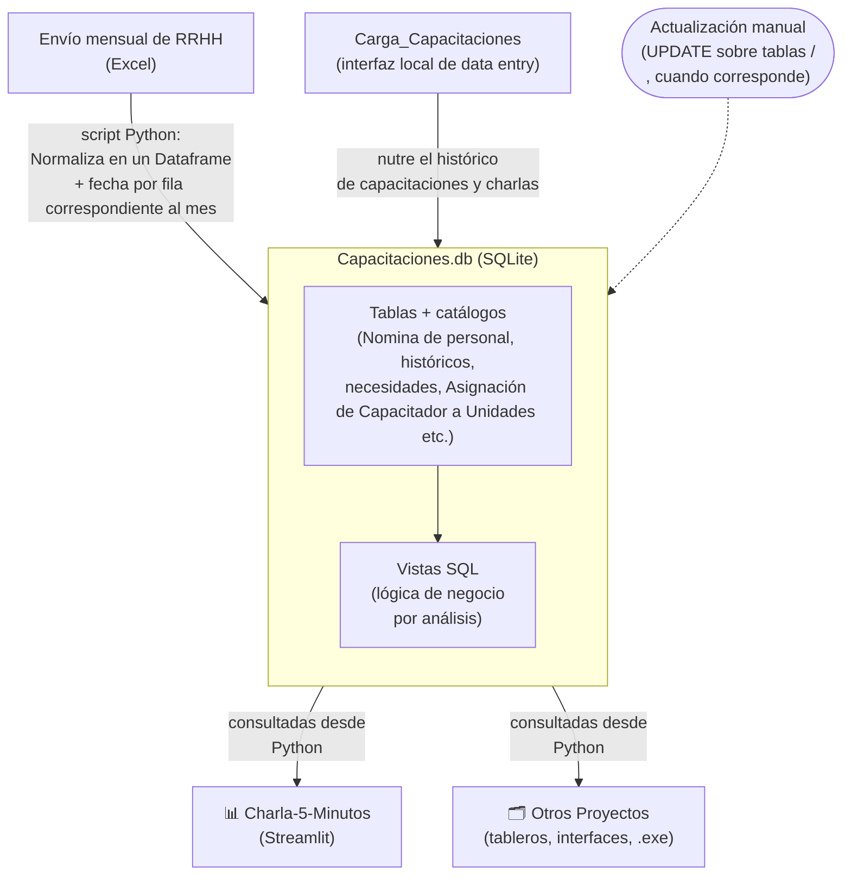
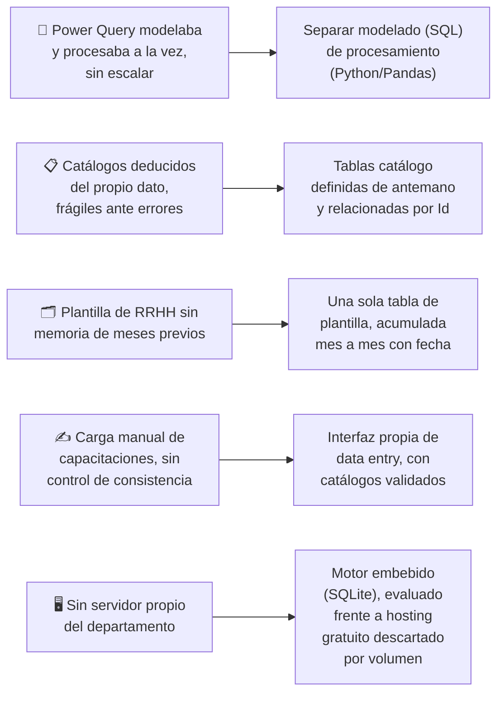

# Capacitaciones.db — Modelar en SQL lo que antes se resolvía a fuerza de Excel y Power Query

> **Aclaración de alcance:** lo que se documenta acá es un desarrollo interno del área donde trabajé y trabajo, dentro de una empresa más grande. **No es la base de datos corporativa de la empresa ni un reemplazo de ella** — es una capa propia del departamento, pensada para procesar y consultar información que antes se resolvía por fuera de cualquier base de datos real.

## De qué se trata este proyecto, antes de entrar en detalle

El departamento donde trabajo dicta y registra dos tipos de actividad formativa de seguridad: **charlas breves** (el programa "Charla 5 Minutos", una charla corta y periódica que se dicta al personal operativo sobre un riesgo puntual de su tarea) y **capacitaciones extensas con evaluación**, de mayor duración. Cada persona pertenece a una unidad organizativa dentro de la empresa, y esa unidad es la que define qué capacitaciones necesita — así que casi cualquier pregunta de gestión termina cruzando tres cosas: la persona, la capacitación, y a qué unidad pertenecía esa persona en el momento en que se dictó.

`Capacitaciones.db` es el proyecto que le dio a esa información una estructura real. No es, en el fondo, un proyecto sobre "los datos de los empleados" — es un proyecto de **modelado de datos**: tomar un proceso que vivía disperso en Excel y Power Query y pasarlo a una base de datos relacional, para que ese tipo de cruces se puedan resolver con una consulta en vez de con horas de trabajo manual. Una vez que la información está bien modelada — con relaciones claras entre las tablas, en vez de fórmulas apiladas — se pueden hacer análisis mucho más finos: cruzar escenarios específicos, filtrar por ventanas de tiempo puntuales, y llegar al detalle de una persona o de una unidad sin tener que reconstruir esa lógica cada vez desde cero.

Un ejemplo real ilustra bien esto. En un momento me consultaron por una capacitación específica: qué personas de una unidad puntual la habían recibido dentro de una franja de fechas determinada. Para responder eso hacía falta reconstruir quién pertenecía a esa unidad durante ese período (no necesariamente quién pertenece hoy), cruzar eso contra el historial de capacitaciones dictadas en esa misma ventana de tiempo, y así identificar tanto a quienes sí la habían recibido como a quienes, perteneciendo a esa unidad en ese momento, no la habían recibido. Con la base ya modelada, esa consulta se resolvió con un cruce (`JOIN`) entre el histórico de plantilla y el histórico de capacitaciones, en cuestión de segundos.

Y acá va la aclaración importante, porque es central para entender qué resuelve realmente este proyecto: **esa consulta siempre se pudo hacer.** No es que antes fuera imposible — con Power Query hubiera llevado bastante más tiempo, y hecha completamente a mano (abriendo Excels de distintos meses y cruzando uno por uno) podía perfectamente insumir media jornada de trabajo completa. La base de datos no habilitó un análisis nuevo: lo que hizo fue bajar el costo de responder ese tipo de pregunta de "media jornada" a "segundos", gracias a que la información está modelada correctamente de base. Esa es la ventaja real de este proyecto: claridad y velocidad, no capacidades que no existieran antes.

## Resumen Ejecutivo

`Capacitaciones.db` es una base **SQLite propia del departamento** — no la base corporativa de la empresa — que centraliza el histórico completo de charlas y capacitaciones dictadas, entre otras cosas, junto con el histórico de empleados, que cuenta con la información necesaria para saber a qué unidad pertenecía cada persona en cada momento. El proyecto se apoya en una decisión de diseño central: separar el **modelado** de los datos del **procesamiento** de los datos. El modelado — qué tablas existen, cómo se relacionan, qué es catálogo y qué es histórico — vive en SQL. La lógica de negocio específica se resuelve aparte, con Python y Pandas.

Un punto central del modelo son las **tablas catálogo**: cinco o seis tablas que existen únicamente para identificar de forma unívoca entidades que se repiten en todo el histórico (por ejemplo, cada capacitador que pasó por el área, cada tipo de capacitación), cada una con su propio Id. Al estar el resto de la base relacionada con esos catálogos por Id, corregir o completar un dato faltante se hace una sola vez, en un solo lugar, y se refleja automáticamente en todo el histórico relacionado — en vez de tener que salir a buscarlo y reemplazarlo manualmente en decenas de miles de filas.

Sobre esa estructura se construyeron además **vistas SQL con índices**, cada una resolviendo la lógica de un análisis puntual pero masivo y reiterativo (avance por unidad, universo de un capacitador, cobertura de un sistema de gestión), que hoy alimentan el tablero **Charla 5 Minutos** (documentado por separado como su propio caso de estudio en este portafolio).

La plantilla que envía Recursos Humanos, en cambio, se carga con un procesamiento deliberadamente liviano — un script simplemente agrega la fecha del envío y la inserta como filas nuevas — porque el peso real del proyecto, y donde vale la pena invertir en modelado, está del lado de las capacitaciones, no de la plantilla.

## Contexto del Problema

### Power Query no combinaba datos: hacía de base de datos, y no daba abasto

Lo que existía anteriormente era una cadena de archivos Excel conectados entre sí por Power Query, que intentaba resolver todo el procesamiento necesario para sostener un tablero de seguimiento de las capacitaciones (el actual "Charla 5 Minutos").

Power Query intentaba cumplir, al mismo tiempo, el rol que debería cumplir un motor de base de datos y el de un tablero: normalizar la información, cruzar el histórico, y resolver la lógica de negocio y la estadística necesaria para después mostrar todo eso en un Excel a modo de tablero.

El proceso recibía como entrada distintas tablas sin normalizar ni estandarizar, repartidas en múltiples Excels (históricos de charlas, segmentación de personal entre operativos y administrativos, necesidades de capacitación por unidad, entre otras cosas).

Por encima de esto estaba montada toda la lógica de negocio, resuelta a través de múltiples consultas sobre todo ese volumen de datos. Esto ralentizaba muchísimo el procesamiento y dificultaba muchísimo el mantenimiento, debido a la cantidad de errores que se generaban por la fragilidad del software a la hora de modelar esta cantidad de información.

De aqui origina la idea de empezar a utilizar una base de datos para resolver este problema en particular. Luego se fue moldeando y se fueron agregando usos adicionales que la convirtieron en lo que es hoy.

```mermaid
flowchart LR
    subgraph Fuentes["Múltiples Excels sin normalizar"]
        F1["Histórico de charlas"]
        F2["Segmentación operativos<br/>/ administrativos"]
        F3["Necesidades de capacitación<br/>por unidad"]
    end
    Fuentes -->|"Power Query intenta ser,<br/>a la vez, motor de base<br/>de datos y motor de<br/>lógica de negocio"| PQ["Power Query<br/>(normaliza, cruza histórico,<br/>calcula estadísticas)"]
    PQ --> TAB["Excel maestro<br/>a modo de 'tablero'"]
    TAB -.-> P(("Cada vez más lento, frágil<br/>y difícil de mantener a<br/>medida que crece el volumen"))
```

### Restricciones concretas del modelo

- **Catálogos deducidos del dato, en vez de definidos de antemano.** En lugar de partir de una lista cerrada y válida de capacitaciones existentes, Power Query intentaba construir ese catálogo a partir de lo que ya estaba cargado en los Excels de origen. El resultado era un catálogo tan confiable como el dato más inconsistente que hubiera entrado alguna vez al sistema — bastaba una capacitación mal tipeada para que se propagara como si fuera una categoría más.
- **Modelado y procesamiento mezclados en una misma herramienta.** Power Query no solo combinaba archivos: intentaba también resolver ahí mismo la limpieza y la estructura de la información, dos tareas de naturaleza distinta compitiendo entre sí dentro de una herramienta pensada, ante todo, para combinar planillas y hacer normalización sencilla de datos.
- **Lentitud creciente con el volumen.** Con varias fuentes de origen y un histórico de charlas que ya rondaba las 80.000 filas, cualquier ajuste a esa lógica se volvía cada vez más pesado de aplicar y de mantener.
- **Sin memoria histórica — pero del lado de la plantilla, no de las capacitaciones.** Conviene ser preciso acá: el histórico de capacitaciones sí se conservaba completo en ese Excel único. Lo que no tenía memoria era la plantilla de personal: el envío mensual de RRHH reemplazaba al anterior en cada actualización, sin dejar una estructura que permitiera consultar meses previos de forma unificada.
- **Acceso limitado a la fuente de plantilla.** La información de a qué unidad pertenece cada persona vive en un sistema corporativo centralizado al que el departamento no tenía acceso masivo — solo consulta manual, persona por persona. RRHH cubría esa brecha con el envío mensual mencionado arriba, que era, a su vez, uno de los insumos que alimentaba la cadena de Power Query.
- **Lógica duplicada.** Debido a la poca claridad y la fragilidad de lo que estaba armado, había mucha lógica repetida, pero era complicado de ordenar porque había muchas cosas montadas sobre cada uno de esos procesos repetidos.
- **Información no documentada.** No había nada documentado, así que cada vez que hacía falta una modificación —ya fuera por un cambio a nivel organizacional o por un error— había que volver a interiorizarse en la lógica expresada, comprender de nuevo sus limitaciones y tratar de razonar por qué las cosas estaban armadas como estaban, para después intentar resolver sobre una lógica mal montada desde el inicio: había nacido con otro fin, sin pensar que terminaría escalando tanto.
- **Bugs silenciosos** Más allá de esos errores puntuales, a medida que crecía el volumen de registros históricos, Power Query dejó de procesar el conjunto completo de datos: operaba sobre una ventana de tamaño fijo, tomando los registros ordenados del más reciente al más antiguo. El resultado fue que, con cada nueva tanda de capacitaciones cargadas, los registros más viejos quedaban empujados fuera de esa ventana y dejaban de normalizarse — y por lo tanto, de contabilizarse — aunque seguían existiendo en el archivo de origen. Capacitaciones reales, ya dictadas, iban "desapareciendo" progresivamente de los reportes sin que nadie lo notara, porque el error no arrojaba ningún mensaje: el Excel simplemente mostraba cada vez menos historial a medida que pasaba el tiempo.

### Qué devolvía todo esto, al final

A pesar de todas las consultas montadas en Power Query — múltiples fuentes, fórmulas encadenadas, lógica de negocio resuelta ahí mismo —, lo que ese procesamiento devolvía al final era muy simple. El resultado era, una tabla plana: personas en las filas, capacitaciones en las columnas, y una celda coloreada indicando si esa persona tenía la necesidad de esa capacitación y si ya la había cumplido o no. **Sin ninguna fecha de cuando recibio dicha capacitación**.

La imagen de abajo es un pequeño extracto simulado de ese tipo de tabla — con nombres, identificadores y capacitaciones ficticios, sin relación alguna con datos reales del departamento —, solo para ilustrar el formato: en **rojo**, las personas que tienen la necesidad de esa capacitación y todavía no la hicieron; en **verde**, las que la necesitan y ya la hicieron (el número indica cuántas veces); en **blanco**, las personas que no tienen esa necesidad — el valor sigue estando ahí, pero el formato condicional lo pinta del mismo color que el fondo, porque no es relevante contabilizarlo.

### Qué hacía falta

Separar dos responsabilidades que en el esquema anterior estaban mezcladas dentro de una misma herramienta: por un lado, un modelo de datos correcto, con catálogos definidos de antemano y relaciones explícitas; por otro, un procesamiento de datos real, capaz de limpiar y transformar la información de origen antes de que llegara a esas tablas. En paralelo, había que resolver un problema puntual pero distinto: darle a la plantilla de RRHH la memoria histórica que nunca tuvo, así como también a las capacitaciones históricas, que estaban divididas por año, se remontaban hasta 2019 y no se utilizaban en absoluto.

Más allá de las capacitaciones puntualmente, esto respondía a una necesidad más amplia del departamento. El área genera un volumen de información considerable, repartido entre varios procesos (capacitaciones, y otros que fueron surgiendo con el tiempo), y no es razonable esperar que cada persona del equipo resuelva su porción con su propia lógica de Power Query — incluso si así se hiciera, relacionar esa información entre distintos procesos sería, en la práctica, muy difícil de sostener. Hacía falta una infraestructura de datos propia del departamento, no una colección de soluciones individuales inconexas entre sí.

## Objetivo de Negocio

- Migrar el modelado del histórico de capacitaciones (tanto para las capacitaciones como para las charlas) desde Power Query hacia una base propia en SQLite, con tablas catálogo definidas de antemano en lugar de deducidas sobre la marcha.
- Separar el modelado de datos (SQL) del procesamiento de datos (Python/Pandas), como dos etapas distintas del mismo flujo, para no sobrecargar la base de datos ni inhabilitar el uso simultáneo entre los empleados, dado que SQLite es una base de datos serverless.
- Sostener un histórico de capacitaciones consultable y trazable, donde cualquier registro se pueda cruzar con la unidad organizativa vigente de esa persona **en el momento en que la capacitación ocurrió**, no solo con su situación actual.
- Dar memoria histórica a la plantilla de RRHH, acumulando cada envío mensual en lugar de reemplazar al anterior.
- Dar soporte, mediante vistas, a un tablero real (Charla 5 Minutos) capaz de responder preguntas de análisis que el esquema anterior no podía sostener con agilidad.
- Dar a los integrantes del departamento una forma de cargar información nueva sin escribir SQL, evitando los errores de carga típicos de trabajar sobre planillas sueltas.
- Sentar una base de datos pensada para más de un proceso del área, no solo para capacitaciones — de forma que otros procesos del departamento puedan apoyarse en la misma infraestructura en vez de resolver cada uno su propia versión aislada.

## Arquitectura General

```mermaid
flowchart TB
    RRHH["Envío mensual de RRHH<br/>(Excel)"] -->|"script Python:<br/>Normaliza en un Dataframe<br/>+ fecha por fila correspondiente al mes"| DB
    CARGA["Carga_Capacitaciones<br/>(interfaz local de data entry)"] -->|"nutre el histórico<br/>de capacitaciones y charlas"| DB
    UPD(["Actualización manual<br/>(UPDATE sobre tablas /<br/>, cuando corresponde)"]) -.-> DB

    subgraph DB["Capacitaciones.db (SQLite)"]
        direction TB
        TABS["Tablas + catálogos<br/>(Nomina de personal, históricos,<br/>necesidades, Asignación de Capacitador a Unidades etc.)"]
        VIEWS["Vistas SQL<br/>(lógica de negocio<br/>por análisis)"]
        TABS --> VIEWS
    end

    DB -->|"consultadas desde<br/> Python"| DASH["📊 Charla-5-Minutos<br/>(Streamlit)"]
    DB -->|"consultadas desde<br/> Python"| OTROS["🗂️ Otros Proyectos<br/>(tableros, interfaces, .exe)"]
```

**Cómo se dividen las responsabilidades:** el modelado — qué tablas existen, cómo se relacionan, qué es catálogo y qué es histórico — se resuelve en SQL. El procesamiento — unificar formatos y construir los dataframes específicos que necesita cada análisis — se resuelve en Python con Pandas. Esa separación es, en buena medida, lo que el esquema anterior en Power Query no lograba sostener, al intentar resolver ambas cosas a la vez con una herramienta pensada principalmente para combinar planillas y hacer normalización básica de datos.

**Cómo está organizada la información:**

- **Tablas catálogo:** identifican de forma unívoca entidades recurrentes — capacitadores, tipos de capacitación, categorías, nóminas de SG-SST —, cada una con su Id, relacionadas con el resto de la base por ese Id.
- **Histórico de plantilla:** una fotografía por persona y por mes, cargada casi tal cual llega desde RRHH, con la fecha de esa fotografía como único agregado. El estado vigente queda disponible tomando siempre "el mes más reciente".
- **Histórico de capacitaciones:** el registro real de cada charla o capacitación dictada — fecha, persona, tipo, responsable —, heredado del histórico previo de ~80.000 filas y depurado contra las tablas catálogo antes de incorporarse.
- **Vistas de abstracción con índices:** encapsulan la lógica específica de cada análisis (quién debería estar capacitado, quién ya lo está, avance por unidad o por capacitador), para que el tablero no tenga que reconstruir ese cruce en cada consulta.

**Sobre trabajar con más de una base a la vez:** como metodología de trabajo, cuando una consulta necesita combinar información que vive en distintos archivos `.db` del departamento, se usa `ATTACH DATABASE` de SQLite para leer de más de una base dentro de la misma sesión, sin duplicar información entre ellas. Es más una forma de trabajo que una arquitectura formal: permite que cada base se mantenga y evolucione por separado, y aun así cruzar lógica de una hacia la otra cuando hace falta.

**Cómo entra la información nueva:** la carga de charlas y capacitaciones no se hace escribiendo directamente sobre la base ni sobre una planilla suelta. `Carga_Capacitaciones` — documentada por separado como su propio caso de estudio — es una interfaz local pensada para que cualquier integrante del área registre una charla o capacitación dictada eligiendo entre valores ya validados contra las tablas catálogo, en vez de tipear texto libre. Esa misma información, una vez cargada ahí, es la que después consume el tablero Charla 5 Minutos construido en Streamlit.

## Tecnologías Utilizadas

| Tecnología | Propósito |
|---|---|
| SQLite | Motor de base de datos relacional embebido y sin servidor — el departamento no cuenta con infraestructura propia para alojar una base tradicional. |
| SQL (Tablas catálogo + Vistas + Índices) | El modelado de la información: catálogos definidos de antemano, relaciones explícitas, y vistas que resuelven la lógica de cada análisis del tablero. |
| Python + Pandas | El procesamiento de la información: limpieza y transformación de los datos de origen antes de insertarlos, separado deliberadamente del modelado en SQL. |

## Principales Desafíos

```mermaid
flowchart LR
    D1["🐌 Power Query modelaba<br/>y procesaba a la vez,<br/>sin escalar"] --> S1["Separar modelado (SQL)<br/>de procesamiento<br/>(Python/Pandas)"]
    D2["📋 Catálogos deducidos<br/>del propio dato,<br/>frágiles ante errores"] --> S2["Tablas catálogo<br/>definidas de antemano<br/>y relacionadas por Id"]
    D3["🗂️ Plantilla de RRHH sin<br/>memoria de meses previos"] --> S3["Una sola tabla de<br/>plantilla, acumulada<br/>mes a mes con fecha"]
    D4["✍️ Carga manual de<br/>capacitaciones, sin<br/>control de consistencia"] --> S4["Interfaz propia de<br/>data entry, con<br/>catálogos validados"]
    D5["🖥️ Sin servidor propio<br/>del departamento"] --> S5["Motor embebido<br/>(SQLite), evaluado<br/>frente a hosting<br/>gratuito descartado<br/>por volumen"]
```

- **Estandarizar información ambigua y modelar bien la arquitectura desde el inicio.** Este fue, con diferencia, el desafío más grande de todo el proyecto — por encima de migrar el histórico, que en los hechos resultó bastante directo. El detalle de cómo se resolvió está en "Modelar la necesidad de capacitación por unidad", dentro de Solución Implementada.
- **Catálogos deducidos del propio dato, en vez de definidos de antemano.** El detalle de cómo se resolvió está en "Tablas catálogo", dentro de Solución Implementada.
- **Modelado y procesamiento mezclados en una misma herramienta.** El detalle de esta separación está desarrollado en "Modelado en SQL, procesamiento en Python", más abajo.
- **Dar memoria histórica a la plantilla de RRHH.** A diferencia del histórico de charlas, que sí existía completo, la plantilla se perdía mes a mes. Se resolvió con una tabla que acumula cada envío, identificado por su fecha anexandola cada vez al mes a traves de python.
- **Que cargar datos no fuera una fuente de errores en sí misma.** En un momento del proyecto se había decidido dejar de lado los dos Excels donde se cargaban las charlas. La solución fue construir una interfaz de carga propia, con los valores posibles ya definidos por catálogo, en vez de dejar el ingreso de datos abierto a texto libre, para eliminar el problema de la carga con errores de raíz.
- **No contar con servidor propio del área.** Se evaluó alojar una base con servidor en algún servicio gratuito, pero el volumen de información que el departamento acumula con el tiempo excedía cómodamente los límites de esas opciones. SQLite resolvió el problema sin requerir infraestructura adicional.

## Solución Implementada

### Tablas catálogo: modelar antes de cargar, no deducir después

El cambio de fondo respecto del esquema anterior fue este: en vez de dejar que el catálogo de capacitaciones, capacitadores o categorías se fuera armando implícitamente a partir de lo que ya estaba cargado, se definieron esas listas como tablas propias, con su Id, desde el principio. El histórico de capacitaciones y las demás tablas se relacionan con esos catálogos por ese Id, así que corregir un dato faltante o mal cargado se hace una vez, en el catálogo, y se refleja en todo el histórico relacionado — en vez de salir a buscar y reemplazar manualmente en decenas de miles de filas.

### Modelar la necesidad de capacitación por unidad

Migrar el histórico de capacitaciones, una vez resuelto el modelo, terminó siendo un trabajo relativamente directo. Lo realmente difícil fue diseñar la arquitectura que determina qué necesita cada unidad y quién ya cumplió con eso y todos los problemas que eso trajo. — ahí es donde había que estandarizar información que antes estaba cargada de forma ambigua, y pensar una estructura que se pudiera mantener en el tiempo sin volverse frágil otra vez, como le había pasado al esquema anterior.

Ya que en un futuro iba a hacer falta empezar a armar estructuras que se actualizaran en tiempo real a traves de una view, asignando el personal a cada inspector en especifico. Y viendo quienes estaban pendientes de capacitación. 

La lógica quedó separada en instancias sucesivas, cada una resuelta como su propia tabla o vista independiente, porque me pareció la forma más clara de construirla y, sobre todo, de mantenerla después:

1. **Partición inicial: operativos vs. administrativos.** Antes de cualquier otra cosa, una vista siempre calculada sobre el estado vigente ("una lista en vivo") separa a todo el personal entre operativo y administrativo. Las necesidades de capacitación que siguen abajo aplican solo a la rama operativa.
2. **Matriz de necesidades por unidad.** Se identificaron todas las unidades operativas de la empresa y, para cada una, se marcó con un valor booleano qué capacitaciones operativas necesita. Esta información ya estaba parcialmente completada por el modelo anterior, solo que estaba desactualizada y no completa.
Esta matriz vive en una tabla propia, mantenida por el área — es la definición de "qué se necesita", separada a propósito de "quién lo cumplió".
3. **Expansión por persona, vía JOIN.** Una vista cruza esa matriz de necesidades con la partición operativa del personal, usando la unidad como clave de unión: por cada persona operativa, expande las capacitaciones que le corresponden según la unidad a la que pertenece, armando en tiempo real el listado de "quién necesita qué".
4. **Conteo de cumplimiento.** Sobre ese listado ya expandido, otra vista cruza contra el histórico de capacitaciones dictadas y cuenta, para cada persona y cada capacitación que le corresponde, cuántas veces la hizo. Ese conteo es, en definitiva, lo que determina si una celda se pinta de rojo (necesita y no hizo) o de verde (necesita y ya hizo, con el número de veces).

Separar esto en varias instancias, en lugar de resolverlo con una única consulta gigante, fue una decisión deliberada: cada capa se puede revisar, corregir y mantener por separado, sin tener que entender toda la cadena completa para tocar una sola parte.

### Modelado en SQL, procesamiento en Python

La estructura relacional — qué tablas existen, cómo se relacionan, qué vistas resuelven qué pregunta — se define y vive en SQL. La creación de los dataframes que responden preguntas especificas para cada uno de los tableros independientes, se resuelven con Python y Pandas, como una etapa separada. Esta división fue clave para pensar el sistema con escalabilidad desde el inicio, en vez de sobrecargar una sola herramienta con ambas responsabilidades.

### La plantilla de RRHH: carga liviana, a propósito

El envío mensual de RRHH se procesa con un script simple: lee el Excel, selecciona las columnas de interés para el departamento y las inserta como filas nuevas en SQLite, agregando a cada fila la fecha del envío al que corresponde. No hay mayor modelado en este paso, a propósito — el peso real de este proyecto está del lado de las capacitaciones, no de la plantilla, así que este procesamiento se mantuvo deliberadamente simple.

### Puesta en producción: correr en paralelo antes de reemplazar

El reemplazo no fue un salto de un día para el otro, sino un proceso que llevó meses. Durante ese tiempo, el sistema nuevo corrió en paralelo con el esquema anterior de Excel y Power Query: la misma información se procesaba por los dos caminos, y se comparaban los resultados hasta confirmar que coincidían de forma consistente. Recién cuando esa validación se sostuvo en el tiempo se reemplazó el proceso viejo por la base de datos, y se puso en producción el tablero "Charla 5 Minutos".

Incluso después de ese reemplazo, el Excel que la gente ya conocía y usaba como si fuera un "tablero" —aunque, en rigor, nunca lo había sido: era simplemente una tabla con las capacitaciones de cada persona— se siguió generando por un tiempo. Dejó de armarse a mano en Power Query y pasó a producirse extrayendo un CSV directamente desde SQL, procesado y estandarizado con Python hasta quedar idéntico al archivo de siempre. Mantener las dos vías disponibles —el tablero nuevo y el Excel de siempre— le dio al equipo tiempo para ir migrando a su propio ritmo. Algunos meses despues de la implementación, ese Excel dejó de consultarse y el tablero terminó adoptándose de forma natural.

## Resultados Obtenidos

- Consultas puntuales (como la del ejemplo al inicio), que antes hubieran significado horas —o directamente media jornada— de cruce manual entre Excels de distintos meses, hoy se resuelven con una consulta SQL en segundos: no porque antes fuera imposible, sino porque el modelo de datos ahora sostiene ese cruce de forma directa.
- Se reemplazaron los catálogos deducidos implícitamente en Power Query por tablas catálogo explícitas y relacionadas, lo que redujo los errores de consistencia y facilitó tanto corregir datos faltantes en un solo lugar como mantener la base cuando hace falta incorporar lógica nueva.
- Se separó el modelado de datos (SQL) del procesamiento de datos (Python/Pandas), dándole al sistema una base pensada para escalar, a diferencia del esquema anterior que mezclaba ambas responsabilidades en una misma herramienta.
- La plantilla mensual de RRHH, que antes se perdía mes a mes, quedó acumulada en un único histórico consultable.
- Los Excels de capacitaciones, separados por año y que se remontaban hasta 2019, se compilaron en un histórico único y consultable.
- El tablero que consume esta base (Charla 5 Minutos) pasó de apoyarse en un Excel lento y limitado a apoyarse en consultas SQL reales.
- Se resolvió la necesidad de una base relacional sin depender de un servidor que el departamento no tiene.
- Se mejoró la claridad de cada uno de los procedimientos, lo que facilita su mantenimiento, documentación y futura evolución.
- Se agilizó la resolución de consultas puntuales y requerimientos de información de Gerentes, Subgerentes y Jefes sobre situaciones específicas, permitiendo obtener - respuestas mediante consultas SQL en lugar de análisis manuales.
- Se construyó una solución escalable y de bajo mantenimiento, cuya lógica central quedó correctamente modelada desde el inicio, requiriendo únicamente ajustes puntuales o ampliaciones cuando se incorporan nuevos análisis o necesidades de negocio.

## Lecciones Aprendidas

Esto no fue un cambio de un día para el otro: llevó meses. La metodología completa está detallada más arriba, en "Puesta en producción", pero vale la pena resumirla acá porque es, en sí misma, gran parte de lo aprendido: antes de reemplazar nada, corrí ambos sistemas en paralelo hasta confiar en que el nuevo daba resultados consistentes, y aun después del reemplazo mantuve por un tiempo el Excel de siempre como puente, hasta que el equipo migró al tablero por su cuenta.

A nivel personal, lo que más me llevo de este proyecto no es tanto un detalle técnico puntual, sino algunas cosas más de fondo:

- **Aprender a modelar datos de verdad, no solo a guardarlos.** No tenía demasiada experiencia previa pensando una base de datos desde cero; buena parte del proyecto fue aprender, sobre la marcha, a distinguir qué es catálogo y qué es histórico, y cómo relacionarlos para que la información se mantenga consistente sin intervención manual.
- **Diseñar pensando en preguntas que todavía no existían.** El objetivo no era solo resolver las consultas puntuales que hacían falta en ese momento, sino armar una estructura lo suficientemente flexible como para responder, más adelante, preguntas que ni siquiera se me habían ocurrido — y en más de una ocasión, meses después, esa flexibilidad terminó siendo la que sostuvo una necesidad nueva sin tener que rediseñar nada.
- **Migrar el histórico fue lo fácil; modelar bien fue lo difícil.** Pasar 80.000 filas de capacitaciones de Excel a SQLite fue, en los hechos, bastante directo. Lo que realmente costó fue la arquitectura detrás de las necesidades de capacitación por unidad — estandarizar información que antes estaba cargada de forma ambigua, y pensar una estructura que no se volviera frágil otra vez con el tiempo.
- **Confiar en un sistema nuevo lleva tiempo, y está bien que así sea.** Correr los dos sistemas en paralelo durante meses, antes de reemplazar nada, no fue una pérdida de tiempo: fue lo que me permitió confiar en el proceso que había armado, tener la seguridad de que no se estaba perdiendo ningún dato en el camino, y confiar en la lógica detrás de todo esto para que, más adelante, la información que se reporta a Gerencia esté validada y sea comprobable.
- **La importancia de documentar.** Lo que se construyó con esta base de datos genera muchísimo valor: le da claridad a todo el procedimiento y hace que los datos sean confiables, porque es fácil auditar cómo se llega a cada resultado. Independientemente de si sigo trabajando acá o no, documentar todo esto es lo que hace que el proyecto se pueda mantener y perdure en el tiempo — o, si en algún momento se puede, que el departamento logre migrarlo a un servidor propio que es una posibilidad que hoy no existe.

## Próximos Pasos

- [ ] **Dar trazabilidad histórica a las necesidades de capacitación por unidad.** Hoy la base solo conserva qué necesita cada unidad *actualmente*; no hay forma de reconstruir cómo era esa necesidad en un momento del pasado. Funcionó en el ejemplo documentado arriba porque la necesidad de esa unidad puntual no cambió en el tiempo, pero es una limitación real del modelo para unidades donde sí cambió — quedaría resuelta con una tabla de necesidades versionada por fecha, en vez de un estado único vigente.
- [ ] Incorporar un agente de IA para que mantenga la documentación actualizada en relación a los cambios.
- [ ] Incorporar restricciones de integridad referencial explícitas donde hoy la relación entre tablas y entre bases es solo lógica.

## Disclaimer

Este caso de estudio describe conceptos, metodologías y decisiones técnicas de diseño de un conjunto de bases de datos **departamentales e internas**, distintas de la base de datos corporativa de la empresa. No se incluyen datos reales, información confidencial, propiedad intelectual, rutas de servidores internos ni detalles sensibles de la organización donde fue desarrollado.
