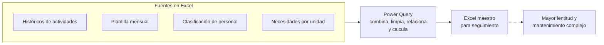
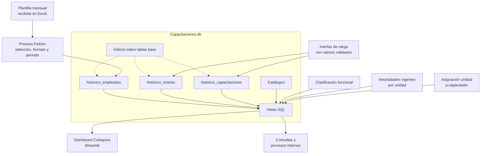
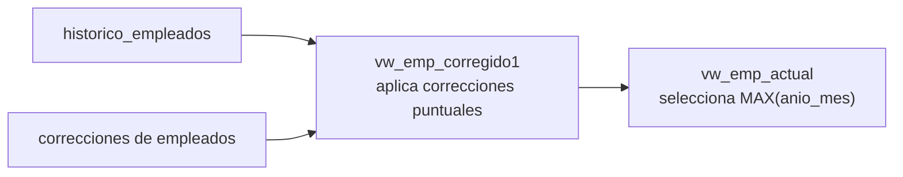
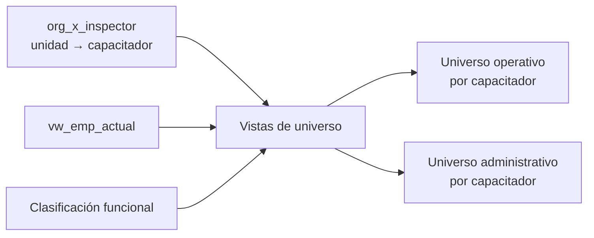

# Capacitaciones.db - Modelado de datos en SQLite

> **Aclaración de alcance:** este caso de estudio documenta una base interna y departamental. No es la base corporativa de la empresa ni pretende reemplazarla. Su objetivo es organizar, relacionar y consultar información que anteriormente se procesaba mediante archivos Excel y Power Query.

## Resumen Ejecutivo

`Capacitaciones.db` es una base SQLite diseñada para centralizar dos históricos diferentes:

- **Coloquios breves:** instancias periódicas asociadas a contenidos específicos según el perfil y la unidad organizativa de cada persona.
- **Instancias extensas:** actividades de mayor duración que pueden incluir evaluación, modalidad y observaciones.

La base también conserva snapshots mensuales de la nómina corporativa, clasificaciones funcionales, necesidades vigentes por unidad, asignaciones de unidades a capacitadores y universos específicos de SG-SST.

El objetivo principal no fue simplemente trasladar planillas a SQLite. El desafío real fue montar el pipeline con el objetivo de poder responder, de forma consistente, preguntas que combinan:

1. Qué persona se está analizando.
2. A qué unidad pertenece o pertenecía.
3. Qué contenidos necesita esa unidad.
4. Qué instancias realizó la persona.
5. Quién es responsable de su seguimiento.

El resultado es una capa de datos reutilizable que alimenta consultas puntuales, procesos internos y el dashboard [Coloquios](../coloquios/).

## Magnitud Del Modelo

Al momento del relevamiento técnico de agosto de 2026, la base contenía:

| Elemento | Cantidad aproximada |
|---|---:|
| Tablas | 14 |
| Vistas | 12 |
| Índices explícitos | 12 |
| Snapshots históricos de personal | 200.000 filas |
| Registros de coloquios | 71.000 filas |
| Registros de instancias extensas | 36.000 filas |

En conjunto, los tres históricos principales superan las 300.000 filas. La base fue verificada en modo de solo lectura mediante `PRAGMA quick_check`, sin detectar problemas estructurales.

> Las cantidades son una fotografía del momento del relevamiento. La base continúa creciendo a medida que se incorporan nuevos snapshots y registros.

## Contexto Del Problema

### Cuando Power Query termina funcionando como base de datos

El proceso anterior estaba compuesto por múltiples archivos Excel conectados mediante Power Query. La misma herramienta debía combinar fuentes, limpiar valores, deducir catálogos, reconstruir relaciones, aplicar reglas de negocio y generar una tabla final para el seguimiento.

Ese enfoque funcionó mientras el volumen y la cantidad de reglas fueron reducidos. Con el crecimiento del histórico aparecieron limitaciones concretas:

- **Catálogos deducidos del dato, en vez de definidos de antemano.** En lugar de partir de una lista cerrada y válida de capacitaciones existentes, Power Query intentaba construir ese catálogo a partir de lo que ya estaba cargado en los Excels de origen. El resultado era un catálogo tan confiable como el dato más inconsistente que hubiera entrado alguna vez al sistema — bastaba una capacitación mal tipeada para que se propagara como si fuera una categoría más.
- **Modelado y procesamiento mezclados en una misma herramienta.** Power Query no solo combinaba archivos: intentaba también resolver ahí mismo la limpieza y la estructura de la información, dos tareas de naturaleza distinta compitiendo entre sí dentro de una herramienta pensada, ante todo, para combinar planillas y hacer normalización sencilla de datos.
- **Lentitud creciente con el volumen.** Con varias fuentes de origen y un histórico de charlas que ya rondaba las 80.000 filas, cualquier ajuste a esa lógica se volvía cada vez más pesado de aplicar y de mantener.
- **Sin memoria histórica — pero del lado de la plantilla, no de las capacitaciones.** Conviene ser preciso acá: el histórico de capacitaciones sí se conservaba completo en ese Excel único. Lo que no tenía memoria era la plantilla de personal: el envío mensual de RRHH reemplazaba al anterior en cada actualización, sin dejar una estructura que permitiera consultar meses previos de forma unificada.
- **Acceso limitado a la fuente de plantilla.** La información de a qué unidad pertenece cada persona vive en un sistema corporativo centralizado al que el departamento no tenía acceso masivo — solo consulta manual, persona por persona. RRHH cubría esa brecha con el envío mensual mencionado arriba, que era, a su vez, uno de los insumos que alimentaba la cadena de Power Query.
- **Lógica duplicada.** Debido a la poca claridad y la fragilidad de lo que estaba armado, había mucha lógica repetida, pero era complicado de ordenar porque había muchas cosas montadas sobre cada uno de esos procesos repetidos.
- **Información no documentada.** No había nada documentado, así que cada vez que hacía falta una modificación —ya fuera por un cambio a nivel organizacional o por un error— había que volver a interiorizarse en la lógica expresada, comprender de nuevo sus limitaciones y tratar de razonar por qué las cosas estaban armadas como estaban, para después intentar resolver sobre una lógica mal montada desde el inicio: había nacido con otro fin, sin pensar que terminaría escalando tanto.
- **Bugs silenciosos** Más allá de esos errores puntuales, a medida que crecía el volumen de registros históricos, Power Query dejó de procesar el conjunto completo de datos: operaba sobre una ventana de tamaño fijo, tomando los registros ordenados del más reciente al más antiguo. El resultado fue que, con cada nueva tanda de capacitaciones cargadas, los registros más viejos quedaban empujados fuera de esa ventana y dejaban de normalizarse — y por lo tanto, de contabilizarse — aunque seguían existiendo en el archivo de origen. Capacitaciones reales, ya dictadas, iban "desapareciendo" progresivamente de los reportes sin que nadie lo notara, porque el error no arrojaba ningún mensaje: el Excel simplemente mostraba cada vez menos historial a medida que pasaba el tiempo.

### Qué devolvía todo esto, al final

A pesar de todas las consultas montadas en Power Query — múltiples fuentes, fórmulas encadenadas, lógica de negocio resuelta ahí mismo —, lo que ese procesamiento devolvía al final era muy simple. El resultado era, una tabla plana: personas en las filas, capacitaciones en las columnas, y una celda coloreada indicando si esa persona tenía la necesidad de esa capacitación y si ya la había cumplido o no. **Sin ninguna fecha de cuando recibio dicha capacitación**.



```mermaid
flowchart LR
    subgraph Fuentes["Fuentes en Excel"]
        F1["Históricos de actividades"]
        F2["Plantilla mensual"]
        F3["Clasificación de personal"]
        F4["Necesidades por unidad"]
    end

    Fuentes --> PQ["Power Query<br/>combina, limpia, relaciona<br/>y calcula"]
    PQ --> EX["Excel maestro<br/>para seguimiento"]
    EX -.-> L["Mayor lentitud y<br/>mantenimiento complejo"]
```

## Objetivos

- Centralizar los históricos de coloquios e instancias extensas.
- Conservar snapshots mensuales de la estructura organizativa.
- Definir catálogos explícitos en lugar de deducirlos desde texto libre.
- Separar el modelado en SQL del procesamiento realizado con Python y Pandas.
- Representar las necesidades vigentes por unidad organizativa.
- Formalizar la asignación de unidades a capacitadores.
- Exponer vistas reutilizables para dashboards y consultas internas.
- Prevenir duplicados en los históricos principales.
- Permitir nuevas cargas mediante interfaces controladas, sin exigir que el usuario escriba SQL.

## Arquitectura General


```mermaid
flowchart TB
    RRHH["Plantilla mensual<br/>recibida en Excel"]
    PY1["Proceso Python<br/>selección, formato y período"]
    CARGA["Interfaz de carga<br/>con valores validados"]
    CLAS["Clasificación funcional"]
    NEC["Necesidades vigentes<br/>por unidad"]
    ASIG["Asignación unidad<br/>a capacitador"]

    subgraph DB["Capacitaciones.db"]
        HE["historico_empleados"]
        HC["historico_charlas"]
        HCAP["historico_capacitaciones"]
        CAT["Catálogos"]
        V["Vistas SQL"]
        IDX["Índices sobre tablas base"]

        HE --> V
        HC --> V
        HCAP --> V
        CAT --> V
        IDX -.-> HE
        IDX -.-> HC
        IDX -.-> HCAP
    end

    RRHH --> PY1
    PY1 --> HE
    CARGA --> HC
    CARGA --> HCAP
    CLAS --> V
    NEC --> V
    ASIG --> V
    V --> DASH["Dashboard Coloquios<br/>Streamlit"]
    V --> CONS["Consultas y<br/>procesos internos"]
```

### División de responsabilidades

| Capa | Responsabilidad |
|---|---|
| SQLite | Persistencia, catálogos, históricos, índices y vistas de consulta. |
| SQL | Relaciones lógicas, filtros recurrentes, agregaciones y universos de análisis. |
| Python + Pandas | Ingesta, limpieza, transformación y preparación de datasets específicos. |
| Interfaces de carga | Validación de entradas y escritura controlada. |
| Streamlit | Presentación, filtros interactivos, indicadores y reportes. |

SQLite fue elegido porque no requiere un proceso servidor ni infraestructura adicional. El patrón de uso es mayormente analítico y de lectura; las escrituras se concentran en procesos controlados. Esto reduce conflictos, aunque no elimina las limitaciones de concurrencia propias de una base embebida.

## Modelo De Datos

El diseño actual es un **modelo híbrido**. Utiliza tablas históricas, catálogos e identificadores lógicos, pero conserva algunos campos descriptivos dentro de los históricos para mantener compatibilidad con procesos anteriores.

No todas las relaciones están declaradas mediante claves foráneas. En varios casos la integridad se sostiene por reglas de carga, catálogos validados, índices únicos y cruces lógicos en las vistas. Esta distinción es importante: la base tiene estructura relacional, pero todavía no aplica integridad referencial explícita en todo el esquema.

### Históricos principales

| Tabla | Función |
|---|---|
| `historico_empleados` | Snapshot mensual de la plantilla y su estructura organizativa. |
| `historico_charlas` | Registro de coloquios con fecha, persona, contenido y capacitador. |
| `historico_capacitaciones` | Registro de instancias extensas con fecha, código, duración, evaluación, modalidad y observaciones. |

El histórico de personal conserva el campo `anio_mes`, que permite diferenciar cada fotografía mensual. Esto habilita consultas temporales que relacionan un evento con la estructura organizativa correspondiente a ese período.

### Catálogos

La base contiene catálogos para contenidos, categorías, capacitadores y universos SG-SST. Su función es definir valores válidos y evitar que las entidades recurrentes dependan únicamente del texto ingresado en cada registro.

En el modelo actual conviven dos estrategias:

- Relaciones mediante identificadores lógicos, como el código de contenido.
- Campos descriptivos conservados en los históricos por compatibilidad y facilidad de consumo.

La relación lógica entre `historico_charlas.id_charla` y `catalogo_charlas.Id` cubre el histórico principal de coloquios. Otros catálogos y los históricos anteriores presentan algunas excepciones heredadas. Estas excepciones se tratan como deuda de calidad de datos, no como una característica deseada del modelo.

### Clasificación funcional

`Necesidades_Objetivos` contiene la clasificación utilizada para separar perfiles operativos, administrativos y casos especiales. Las vistas interpretan sus columnas de clasificación junto con atributos del snapshot vigente, como estado y categoría.

La clasificación no se deduce desde los eventos realizados. Es una fuente independiente que define a qué universo pertenece cada persona.

### Matriz de necesidades

`necesidades_charlas_org` representa qué contenidos necesita cada unidad organizativa mediante indicadores booleanos. Es una tabla ancha: cada fila representa una unidad y cada columna de contenido indica si existe necesidad.

Esta decisión simplificó la migración desde el modelo anterior y facilita ciertas consultas de presentación. A cambio, incorporar nuevos contenidos requiere modificar el esquema y actualizar las expresiones que relacionan cada columna con el catálogo correspondiente.

La matriz representa el **estado vigente**. Actualmente no conserva versiones históricas de las necesidades.

### Asignación de capacitadores

`org_x_inspector` formaliza qué capacitador tiene asignada cada unidad organizativa. El nombre físico de la tabla se conserva por compatibilidad histórica; en la documentación pública y en la interfaz se utiliza el término **capacitador**.

Esta tabla convierte una asignación que antes dependía del conocimiento informal del equipo en un dato consultable. También permite construir universos de personas por responsable.

### Correcciones puntuales

La tabla de correcciones de empleados permite reemplazar información puntual sin modificar todas las filas históricas. La vista de empleados corregidos aplica `COALESCE` para priorizar el valor corregido y conservar el original cuando no existe una corrección.

Este mecanismo evita actualizaciones masivas sobre el histórico y mantiene separada la fuente recibida de los ajustes administrados localmente.

## Lógica Del Servicio

La base no expone una única consulta gigante. La lógica se divide en capas que pueden verificarse y mantenerse por separado.

### 1. Construcción del snapshot vigente


```mermaid
flowchart LR
    H["historico_empleados"] --> C["vw_emp_corregido1<br/>aplica correcciones puntuales"]
    R["correcciones de empleados"] --> C
    C --> A["vw_emp_actual<br/>selecciona MAX(anio_mes)"]
```

`vw_emp_corregido1` combina cada snapshot con las correcciones administradas localmente. `vw_emp_actual` toma el máximo `anio_mes` disponible y expone la fotografía organizativa vigente.

Este snapshot se reutiliza en la mayoría de las vistas operativas, administrativas, de asignación y SG-SST.

### 2. Construcción del universo operativo

Según la vista consumidora, el universo operativo se obtiene combinando:

1. La clasificación funcional.
2. El snapshot vigente.
3. El estado de la persona.
4. Las reglas de categoría aplicables.
5. La matriz de necesidades de su unidad.

`vw_operativo_streamlit` cruza los eventos realizados con la necesidad vigente de la unidad para el conjunto de contenidos codificado en su definición. Solo incluye combinaciones donde el contenido realizado corresponde a una necesidad configurada.

Otras vistas generan una representación agregada por persona, utilizando sumas condicionales para convertir eventos en columnas de cumplimiento. Esa salida reproduce la matriz que históricamente se consumía desde Excel, pero ahora se calcula desde datos centralizados.

### 3. Construcción del universo administrativo

El universo administrativo utiliza una rama diferente de la clasificación funcional. Las vistas verifican que la persona:

- Esté clasificada como administrativa.
- No pertenezca simultáneamente a las ramas operativas.
- Tenga atributos de categoría válidos.
- Cumpla las condiciones de estado definidas para la vista consumidora.

El cumplimiento se calcula contra un conjunto acotado de contenidos administrativos. Las reglas están expresadas actualmente dentro de las definiciones SQL de las vistas.

### 4. Universo por capacitador


```mermaid
flowchart LR
    A["org_x_inspector<br/>unidad → capacitador"] --> U["Vistas de universo"]
    E["vw_emp_actual"] --> U
    C["Clasificación funcional"] --> U
    U --> OP["Universo operativo<br/>por capacitador"]
    U --> AD["Universo administrativo<br/>por capacitador"]
```

Las vistas de asignación cruzan la unidad vigente de cada persona con `org_x_inspector`. Después aplican la clasificación correspondiente para construir universos operativos y administrativos.

Esta capa permite responder quién está a cargo de cada capacitador sin reconstruir manualmente la asignación en cada consulta.

### 5. Cobertura SG-SST

Las vistas SG-SST parten de un catálogo propio de personas y tipos. Ese universo se cruza con:

- El snapshot organizativo vigente.
- Los históricos de coloquios o instancias extensas.
- La asignación del capacitador responsable.

Una vista cuenta coloquios recibidos dentro del período configurado. Otra transforma determinados códigos de instancias extensas en indicadores booleanos mediante agregaciones condicionales.

### 6. Consultas históricas

El modelo permite relacionar eventos con snapshots mensuales, pero las vistas principales del dashboard trabajan mayormente con `vw_emp_actual`. Por lo tanto, muestran la unidad vigente de la persona, incluso cuando el evento pertenece a un período anterior.

Para reconstruir una situación histórica se requiere una consulta específica que relacione la fecha del evento con `anio_mes` del histórico de personal.

```sql
SELECT
    evento.Fecha,
    evento.Sobre,
    plantilla."Organización Actual"
FROM historico_charlas AS evento
JOIN historico_empleados AS plantilla
    ON plantilla.Sobre = evento.Sobre
   AND plantilla.anio_mes = strftime('%Y-%m', evento.Fecha);
```

Esta capacidad existe gracias al histórico mensual, pero todavía no está encapsulada de forma uniforme en todas las vistas.

## Vistas Principales

| Grupo | Vistas | Responsabilidad |
|---|---|---|
| Plantilla | `vw_emp_corregido1`, `vw_emp_actual` | Aplicar correcciones y seleccionar el snapshot vigente. |
| Operativos | `vw_charlas_operativo`, `vw_charla_5_operativos`, `vw_operativo_streamlit` | Construir actividad y cumplimiento del universo operativo. |
| Administrativos | `vw_charla_administrativos`, `vw_administrativo_streamlit` | Construir actividad y cumplimiento administrativo. |
| Asignaciones | `vw_inspector_universo`, `vw_inspector_universo_administrativo` | Relacionar personas y unidades con capacitadores. |
| SG-SST | `vw_SG_charlas`, `vw_simulacro_SG2` | Calcular cobertura sobre universos específicos. |
| Perfiles de gestión | `vw_jefaturas_actuales` | Exponer una selección vigente para consultas internas. |

Algunos nombres físicos conservan términos del sistema anterior. Cambiarlos directamente implicaría actualizar consumidores existentes, por lo que la terminología pública se normaliza sin romper compatibilidad en el esquema.

## Índices Y Rendimiento

SQLite no permite crear índices tradicionales sobre vistas normales. Los 12 índices del proyecto están definidos sobre las tablas base y son utilizados por el planificador cuando evalúa las vistas.

### Estrategias aplicadas

- Índices individuales sobre fecha, persona y contenido en el histórico de coloquios.
- Índice compuesto para consultas por contenido, fecha y persona.
- Índices sobre `Sobre`, `anio_mes` y la combinación de ambos en el histórico de empleados.
- Índice sobre organización para resolver necesidades por unidad.
- Índice sobre la clasificación funcional por persona.
- Índices únicos para prevenir registros duplicados en los dos históricos de actividades.

### Grano de unicidad

```text
Coloquios:
    Fecha + Persona + Id de contenido

Instancias extensas:
    Fecha + Persona + Código de contenido
```

Los índices reducen el costo de los filtros más frecuentes y protegen el grano esperado de cada evento cuando las columnas que lo componen tienen valores informados. Como esas columnas todavía no declaran todas las restricciones `NOT NULL`, los valores nulos requieren validación adicional durante la carga. Las vistas pueden seguir utilizando estructuras temporales para operaciones como `DISTINCT` o `GROUP BY`, especialmente en los universos administrativos y SG-SST.

## Integridad Y Calidad De Datos

El esquema actual utiliza tres mecanismos principales:

1. Claves primarias en históricos y algunas tablas catálogo.
2. Índices únicos para evitar duplicados de eventos.
3. Validaciones externas en los procesos de carga.

No existen triggers ni claves foráneas declaradas. Las relaciones entre personas, contenidos, capacitadores y unidades son actualmente lógicas. Esto brinda flexibilidad durante la migración, pero permite que datos heredados queden fuera de un catálogo si la carga no los valida previamente.

El relevamiento encontró excepciones aisladas de formato y relaciones incompletas en datos heredados. No afectan la integridad estructural del archivo, pero justifican incorporar controles formales y un proceso de staging para futuras migraciones.

## Procesamiento Con Python Y Pandas

La base resuelve persistencia y lógica SQL reutilizable. Los procesos externos se encargan de:

- Leer fuentes Excel.
- Seleccionar las columnas necesarias.
- Normalizar tipos y formatos.
- Agregar el período correspondiente al snapshot.
- Validar valores contra catálogos.
- Insertar registros mediante procesos controlados.
- Preparar datasets particulares para dashboards o reportes.

Esta división evita convertir las vistas en una capa de limpieza general. SQL modela y consulta; Python procesa los insumos antes de insertarlos y adapta las salidas cuando un consumidor necesita una forma específica.

Los scripts de ingesta no forman parte del archivo SQLite y, por lo tanto, su comportamiento histórico no puede reconstruirse únicamente inspeccionando la base. En este documento se describe su responsabilidad general, no una implementación que no esté incluida en el caso de estudio.

## Consultas Entre Bases

Cuando un análisis necesita información almacenada en otro archivo SQLite del departamento, se utiliza `ATTACH DATABASE` para consultar ambos esquemas dentro de una misma sesión.

```sql
ATTACH DATABASE 'otra_base.db' AS otra;

SELECT ...
FROM main.tabla_local AS local
JOIN otra.tabla_externa AS externa
    ON local.clave = externa.clave;
```

Esta es una práctica de consulta, no una relación física persistida dentro de `Capacitaciones.db`. Cada base puede evolucionar por separado y combinarse cuando una necesidad concreta lo requiere.

## Puesta En Producción

La migración no se realizó mediante un reemplazo inmediato. Durante varios meses el sistema nuevo y el proceso anterior se ejecutaron en paralelo. Los resultados se compararon hasta obtener consistencia suficiente para reemplazar la cadena de Excel y Power Query.

Como transición, el equipo continuó recibiendo temporalmente un archivo con el formato conocido. La diferencia era que ese archivo ya no se construía mediante la cadena anterior: se generaba desde SQL y se procesaba con Python para conservar una salida familiar.

Este período de convivencia permitió validar la lógica y reducir el costo de adopción. El tablero terminó reemplazando al archivo anterior de forma gradual.

## Resultados Obtenidos

- Consultas que requerían cruzar manualmente varios archivos pasaron a resolverse en segundos mediante SQL.
- La plantilla mensual dejó de sobrescribirse y se convirtió en un histórico consultable.
- Los eventos de diferentes períodos quedaron centralizados en históricos únicos.
- Se incorporaron catálogos explícitos para reducir variaciones de texto.
- Las asignaciones de unidades a capacitadores dejaron de depender exclusivamente del conocimiento informal.
- Las reglas recurrentes se encapsularon en vistas reutilizables.
- El dashboard dejó de depender de una cadena de Power Query para obtener sus datos.
- La solución pudo implementarse sin disponer de un servidor de base de datos propio.
- La ejecución paralela permitió validar el reemplazo antes de retirar el proceso anterior.

El beneficio principal no fue habilitar preguntas que antes fueran imposibles. Fue reducir drásticamente el tiempo y la complejidad necesarios para responderlas, con reglas que pueden revisarse y ejecutarse nuevamente.

## Limitaciones Conocidas

- La matriz de necesidades representa solo el estado vigente y no está versionada por fecha.
- Varias vistas relacionan eventos históricos con la unidad actual de la persona.
- Algunas reglas temporales están fijadas directamente a 2026 dentro del SQL.
- Los contenidos operativos están mapeados mediante columnas y condiciones explícitas.
- No existen claves foráneas declaradas.
- Parte del histórico conserva valores descriptivos además de los identificadores.
- Las columnas que forman las claves naturales de los eventos no declaran todas las restricciones `NOT NULL`.
- Existen excepciones aisladas heredadas de formatos anteriores.
- El esquema no utiliza `PRAGMA user_version` para versionar migraciones.
- SQLite ofrece concurrencia de escritura limitada frente a una base con servidor.

Estas limitaciones no invalidan el uso actual, pero definen con claridad qué debería evolucionar si aumenta el volumen, cambia el modelo de necesidades o se incorporan más consumidores.

## Próximos Pasos

- [ ] Versionar las necesidades por unidad con fecha de vigencia.
- [ ] Incorporar claves foráneas después de normalizar las excepciones heredadas.
- [ ] Incorporar restricciones `NOT NULL` en las claves naturales utilizadas por los índices únicos.
- [ ] Reemplazar los años fijados en las vistas por configuración o períodos parametrizables.
- [ ] Evaluar una tabla relacional `unidad_contenido` para reemplazar la matriz ancha.
- [ ] Centralizar los contenidos administrativos y operativos en tablas de configuración.
- [ ] Incorporar migraciones de esquema con `PRAGMA user_version`.
- [ ] Agregar pruebas automatizadas para las reglas principales de cada vista.
- [ ] Documentar dependencias entre vistas y consumidores externos.
- [ ] Evaluar una migración futura a un motor con servidor si la concurrencia o el volumen lo justifican.

## Lecciones Aprendidas

| Área | Aprendizaje |
|---|---|
| Modelado | Guardar datos no es lo mismo que modelarlos. El valor aparece cuando las relaciones permiten responder nuevas preguntas sin reconstruir la lógica. |
| Calidad | Los catálogos deben definirse antes de la carga, no deducirse de valores históricos potencialmente inconsistentes. |
| Historia | Un snapshot mensual simple puede ser más valioso que una transformación compleja si permite reconstruir estados anteriores. |
| Rendimiento | Los índices deben responder a los patrones reales de consulta y ubicarse en las tablas base utilizadas por las vistas. |
| Migración | Ejecutar ambos sistemas en paralelo no fue trabajo duplicado: fue el mecanismo que permitió validar el reemplazo. |
| Adopción | Mantener temporalmente una salida conocida facilitó que el equipo migrara al nuevo tablero a su propio ritmo. |
| Mantenimiento | Dividir la lógica en capas pequeñas facilita revisar una regla sin comprender nuevamente todo el sistema. |
| Documentación | Describir también las limitaciones evita presentar una arquitectura idealizada y permite planificar su evolución. |

## Tecnologías Utilizadas

| Tecnología | Propósito |
|---|---|
| SQLite | Persistencia relacional embebida, vistas e índices sin infraestructura de servidor. |
| SQL | Modelado, agregaciones, universos y reglas de consulta reutilizables. |
| Python | Ingesta, validación, automatización y acceso desde aplicaciones. |
| Pandas | Limpieza, transformación y preparación de datasets. |
| Streamlit | Consumo interactivo de la información mediante el dashboard Coloquios. |
| Git | Versionado del código y la documentación asociada. |

## Disclaimer

Este caso de estudio documenta conceptos, decisiones técnicas y aprendizajes obtenidos al construir una base departamental interna. No corresponde a la base corporativa de la empresa.

No se incluyen registros individuales, rutas internas, nombres de personas, resultados sensibles ni archivos de producción. Los volúmenes publicados son aproximados y los nombres físicos de algunas tablas y vistas se mencionan únicamente para explicar la arquitectura técnica.
