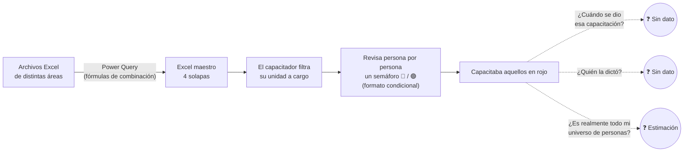
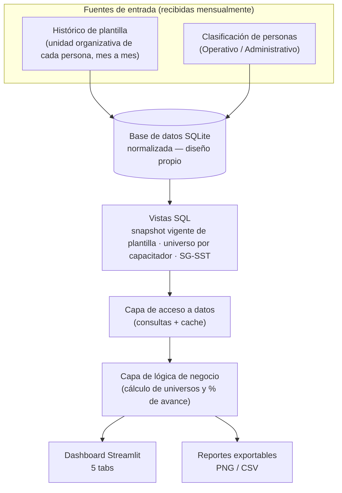
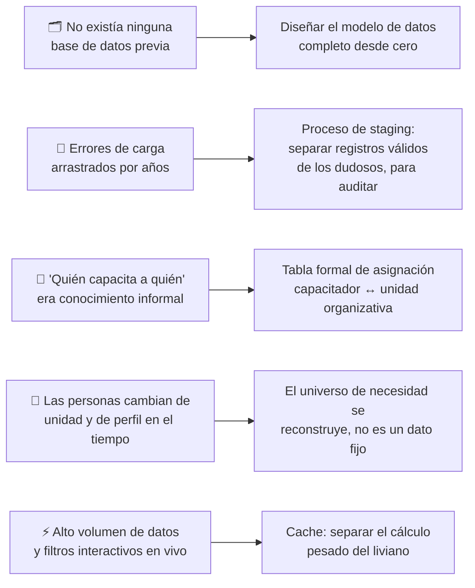
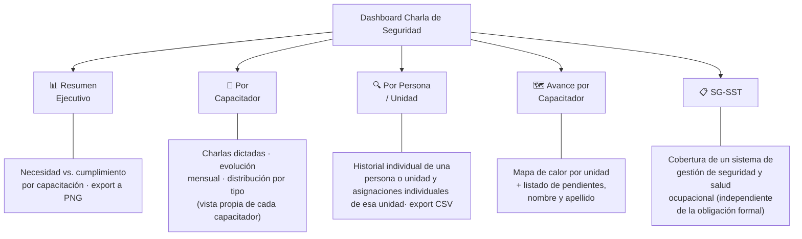
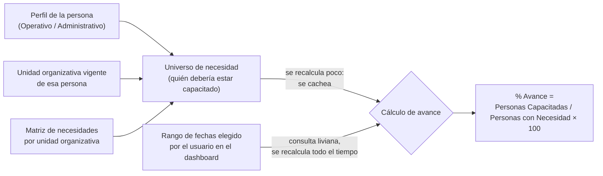

# Charlas de Seguridad — Sistema de Seguimiento de Capacitaciones de Seguridad Industrial

## Resumen Ejecutivo

En la empresa donde trabajo existe un programa interno de seguridad industrial llamado **"Charla 5 Minutos"**: capacitaciones breves y obligatorias que el personal debe recibir periódicamente sobre riesgos específicos de su tarea. No todo el personal necesita las mismas capacitaciones — depende de su perfil laboral (si es personal de campo/operativo o de oficina/administrativo) y de la unidad a la que pertenece dentro de la organización.

El programa es dictado por un grupo de personas del área de Seguridad Industrial a quienes en este documento voy a llamar **capacitadores**: son quienes recorren las distintas unidades y dictan estas charlas al personal a su cargo.

Diseñé y desarrollé de punta a punta la solución que hoy sostiene este programa: una **base de datos SQLite construida desde cero** que centraliza y normaliza toda la información, y un **dashboard interactivo en Streamlit** que calcula y muestra en tiempo real quién necesita cada capacitación, quién ya la recibió, y cuánto falta.

## Contexto del Problema

### ¿Cómo se trabajaba antes de este proyecto?

Todo el seguimiento se hacía sobre un único archivo Excel, compuesto por cuatro solapas (personal operativo, personal administrativo, una matriz de "qué capacitación necesita cada unidad organizativa" y un avance estadistico de capacitados/necesidad para cada capacitación). Ese Excel no leía de una base de datos: se armaba con conexiones de **Power Query** que combinaban, mediante fórmulas, otros archivos Excel de origen.

El flujo de trabajo de un capacitador era manual:

El capacitador filtraba manualmente la planilla por su unidad, y a partir de un semáforo rojo/verde (formato condicional de Excel) intentaba estimar si cada persona estaba o no capacitada. Ese semáforo no decía **cuándo** se había dictado la capacitación ni **quién** la había dictado — solo mostraba un estado aparente, sin ninguna trazabilidad real detrás.

### Limitaciones concretas que esto generaba

- **El universo de personas de cada capacitador era una estimación, no un dato certero.** No existía ninguna tabla que dijera formalmente "esta unidad organizativa está a cargo de tal capacitador". Cada capacitador sabía, de memoria y por experiencia, más o menos qué unidades le correspondían.
- **Cero trazabilidad histórica.** El semáforo mostraba un estado actual aparente, pero no había forma de auditar fecha ni responsable de cada capacitación dictada.
- **Errores de carga heredados y nunca corregidos.** Las fórmulas de Power Query normalizaban la información hasta cierto punto, pero aun asi, no era un sistema robusto y arrastraba durante años registros duplicados o inconsistentes, sin que nadie los hubiera detectado ni corregido.
- **Errores de software silenciosos por límite de procesamiento** A medida que crecía el volumen de registros históricos, Power Query dejó de procesar el conjunto completo de datos: operaba sobre una ventana de tamaño fijo, tomando los registros ordenados del más reciente al más antiguo. El resultado fue que, con cada nueva tanda de capacitaciones cargadas, los registros más viejos quedaban empujados fuera de esa ventana y dejaban de normalizarse — y por lo tanto, de contabilizarse — aunque seguían existiendo en el archivo de origen. Capacitaciones reales, ya dictadas, iban "desapareciendo" progresivamente de los reportes sin que nadie lo notara, porque el error no arrojaba ningún mensaje: el Excel simplemente mostraba cada vez menos historial a medida que pasaba el tiempo.
- **Los jefes de área no tenían ninguna vista consolidada.** No podían ver el avance de una persona en particular, ni comparar el desempeño entre distintos capacitadores. Solo existía la planilla completa, que había que filtrar manualmente para sacar cualquier conclusión. Lo cual para cual ejecutivo era una perdida de tiempo, por ende no se analizaba esa información.
- **El sistema no escalaba.** Cualquier cambio en la estructura organizativa (una persona que cambiaba de unidad, una unidad que sumaba una capacitación nueva a su lista de necesidades) implicaba reconstruir a mano las conexiones de Power Query.
- **Lentitud en el sistema** Debido a la cantidad de excels y el volumen de cada archivo, provocaba gran lentitud a la hora de generar cambios estructurales en las consultas de Power Query, haciendo la consulta de información una verdadera pesadilla.
- **Personal no contemplado** Al ser el universo de personas a capacitar tan extenso y no tener asignado formalmente a cada capacitador a una unidad, quedaba bastante personal sin capacitar por grandes periodos de tiempo ya que formalmente no le correspondia a nadie. 

### Lo que se necesitaba

Una base de datos real y normalizada, que sirviera como única fuente de verdad, capaz de:

1. Definir formalmente qué universo de personas le corresponde a cada capacitador (no una estimación).
2. Poder visualizar la información ya existente de cada capacitación dictada: a quién, cuándo y por quién.
3. Calcular el porcentaje de avance de cumplimiento de forma reproducible, sin depender de fórmulas manuales.
4. Servir de base a una herramienta de consulta accesible para capacitadores, jefes de área y auditores de los capacitadores.

## Objetivo de Negocio

- Reemplazar el proceso manual de Excel + Power Query por una base de datos relacional real, versionable y sencillamente auditable.
- Darle a cada capacitador el universo exacto (nombre y apellido) de personas que debe capacitar, eliminando la estimación informal.
- Calcular el porcentaje de avance comparando, de forma consistente, personas con necesidad de capacitación contra personas efectivamente capacitadas en un período determinado.
- Construir un dashboard de autoservicio para que cada perfil de usuario (capacitador, jefe de área, gestión) resuelva sus propias consultas.
- Detectar y corregir, durante el proceso de normalización, los errores de carga histórica que se habían acumulado durante años.

> **Sobre los indicadores de éxito:** al momento de este proyecto, la empresa no contaba con ninguna métrica confiable previa (si bien lo que mostraba el Excel era trazable y auditable, en la práctica era irrealizable debido a la complejidad y al tiempo que conllevaria). Por eso el criterio de éxito no fue "mejorar un número existente", sino **habilitar por primera vez la posibilidad de medir con confianza**: que cada capacitador supiera con nombre y apellido quién tiene pendiente, que el porcentaje de avance fuera reproducible, y que un jefe pudiera hacer seguimiento individual y comparar capacitadores — algo que antes se podia llegar a estimar pero con un gran margen de error.

## Arquitectura General

La solución se apoya en dos fuentes de información externas (las únicas que recibo de otras áreas): el histórico mensual de dónde está asignada cada persona dentro de la organización, y una tabla que clasifica a cada persona como operativa o administrativa. A partir de ahí, todo el resto del diseño — el esquema de la base de datos, las vistas, la matriz de necesidades por unidad y la asignación formal de capacitadores — es autoría propia.

**Algunas de las cosas qué contiene la base de datos** que diseñé y construí:
- El histórico mensual de la estructura organizativa de cada persona.
- La clasificación de cada persona en un perfil (operativo, administrativo, o un caso especial fuera de esos dos universos).
- Una matriz de necesidades de capacitación por unidad organizativa (qué capacitaciones se exige a cada unidad).
- Una tabla de asignación formal de capacitadores por unidad organizativa — el dato que antes era solo "conocimiento tácito".
- El registro histórico, capacitación por capacitación, de cada evento dictado (fecha, persona, capacitador responsable, entre otras cosas).
- Vistas SQL que encapsulan las combinaciones de datos más usadas por el dashboard.

**El dashboard**, construido en Streamlit, se organiza en cinco vistas funcionales con filtros globales de fecha y componentes de indicadores reutilizables entre pestañas.

**La capa de reporting** genera exportaciones en PNG (tablas redibujadas con Matplotlib, pensadas para verse bien fuera del navegador, por ejemplo en una presentación) y en CSV.

## Tecnologías Utilizadas

| Tecnología | Propósito dentro del proyecto |
|---|---|
| Python | Lenguaje principal: acceso a datos, lógica de negocio e interfaz. |
| SQLite | Motor de base de datos relacional embebido; almacena y normaliza toda la información histórica. |
| Streamlit | Framework para construir el dashboard interactivo sin desarrollar un frontend desde cero. |
| Pandas | Transformación y agregación de los datos leídos desde SQL antes de graficarlos. |
| Plotly | Visualizaciones interactivas dentro del dashboard (barras, series temporales, mapas de calor). |
| Matplotlib | Generación de tablas exportables en PNG para reportes fuera del dashboard. |
| NumPy | Cálculos numéricos de soporte en el procesamiento de datos. |

## Principales Desafíos

- **No existía ninguna base de datos previa:** tuve que definir desde cero qué tablas necesitaba, cuáles debían ser históricas (con snapshot mensual) y cuáles de catálogo/clasificación, y cómo relacionarlas de forma consistente. No había ningún esquema previo del que partir.
- **Errores de carga históricos:** al migrar la información desde los archivos de origen aparecieron inconsistencias invisibles hasta ese momento — nombres de capacitación con variaciones de tipeo, registros duplicados, datos que no coincidían con el catálogo oficial. Construí un proceso de validación que separa los registros válidos de los que no cumplen el formato esperado, para poder revisarlos antes de incorporarlos a la base definitiva.
- **Formalizar "quién capacita a quién":** no existía ninguna tabla que asignara explícitamente qué capacitador era responsable de qué unidad organizativa (y por lo tanto, de qué personas). Tuve que relevar esa información junto a los capacitadores y superiores de los mismos y modelarla como una tabla propia, para que dejara de ser un dato informal en la cabeza de cada capacitador y pasara a ser algo consultable por cualquier usuario del sistema.
- **Calcular avance con datos que cambian en el tiempo:** las personas cambian de unidad organizativa y hasta de perfil (operativo/administrativo) mes a mes, y la necesidad de capacitación depende de esa unidad. Tuve que resolver cómo calcular, para cualquier rango de fechas, un universo de "necesidad" consistente, sin mezclar el estado actual de una persona con su estado histórico en el momento de cada capacitación.
- **Rendimiento sobre un volumen de datos considerable:** el histórico de capacitaciones y el histórico de plantilla acumulan decenas de miles de registros. Filtrar por fecha, unidad y capacitador en cada interacción del dashboard de forma ingenua hubiese sido lento. La solución fue separar el cálculo pesado (determinar qué universo de personas corresponde a cada capacitación, que cambia poco) del cálculo liviano (contar cuántas de esas personas se capacitaron en el rango de fechas elegido, que cambia todo el tiempo), cacheando el primero y dejando el segundo como una consulta simple.

## Solución Implementada

### Las cinco vistas del dashboard

- **Resumen ejecutivo:** vista general del programa completo — cuántas personas (operativas y administrativas) necesitan capacitación, cuántas ya la recibieron, comparación por capacitación con distinción visual de las consideradas prioritarias segun cada semestre, y exportación de reportes en PNG para presentaciones como asi tambien un tablero mostrando el avance de cada capacitador unicamente teniendo en cuenta las capacitaciones prioritarias del semestre tambien exportable.
- **Vista por capacitador:** pensada para que cada capacitador haga seguimiento de su propia gestión — cantidad de charlas dictadas, personas únicas capacitadas, evolución mensual y distribución por tipo de capacitación.
- **Vista por persona / unidad:** consulta puntual del historial de capacitaciones de un individuo o de una unidad completa y las asignaciones que tienen y dependiendo de la unidad a la que pertencen que capacitaciones deben realizar y si las han hecho o no en el periodo de tiempo estimado, con exportación a CSV.
- **Avance por capacitador:** cruza el universo formal de personas a cargo de cada capacitador (ahora un dato real, no una estimación) contra las capacitaciones, mostrando un mapa de calor por unidad y tambien cuenta graficos de barra mostrando el avance de cada capacitación haciendo capacitados/necesidad. Luego tambien tablas de que personas deben ser capacitadas por unidad y quienes todavia no han recibido que capacitaciones dentro de esa unidad. Por ultimo un listado de las personas pendientes de capacitar con el fin de poder ser exportado de la platafomra en csv.
- **SG-SST:** identifica quién recibió al menos una capacitación asociada a un sistema de gestión de seguridad y salud ocupacional, sin depender de que exista una obligación formal registrada para esa persona.

Todas las vistas comparten un filtro global de rango de fechas y componentes de tarjetas de indicadores reutilizables, para mantener consistencia visual y de comportamiento en toda la aplicación.

### Cómo se calcula el porcentaje de avance

La fórmula en sí es simple, pero lo que hay detrás de cada uno de sus dos términos no lo es:

El **universo de necesidad** (quién debería estar capacitado) se reconstruye combinando el perfil de la persona, su unidad organizativa vigente y la matriz de necesidades por unidad. Es un cálculo relativamente estable en el tiempo, así que se cachea. El **conteo de personas capacitadas**, en cambio, depende directamente del rango de fechas que el usuario elige en el dashboard, así que se resuelve como una consulta liviana que se recalcula al vuelo. Separar estos dos cálculos es lo que permite que mover el filtro de fechas en el dashboard sea instantáneo, en vez de tener que recalcular desde cero quién pertenece a cada universo cada vez.

**Otros indicadores generados:** evolución mensual de charlas dictadas, mapa de calor de unidad organizativa × capacitación, listado de personas pendientes por capacitador con el detalle de qué les falta específicamente, y cobertura del submódulo SG-SST.

**Automatizaciones incorporadas:** cálculo del universo de necesidad cacheado y refrescado periódicamente sin intervención manual, clasificación automática de capacitaciones como "prioritarias", y generación automática de reportes descargables en PNG a partir de las tablas mostradas en pantalla (sin captura de pantalla manual).

## Resultados Obtenidos

> Como se mencionó antes, la empresa no contaba con ningún proceso de medición confiable previo al proyecto, por lo que no existe una línea de base numérica válida contra la cual comparar. Los indicadores que arrojaba el Excel anterior no eran facilmente trazables ni auditables, así que cualquier comparación porcentual "antes vs. después" sería engañosa. El foco de esta primera etapa estuvo puesto en poder reflejar correctamente la situación real por primera vez, no en demostrar una mejora sobre una métrica previa que, en los hechos, no existía.

- **Beneficio operativo:** cada capacitador dejó de trabajar con una estimación informal de su universo a cargo — ahora tiene, con nombre y apellido, exactamente quién debe capacitarse y quién está pendiente.
- **Beneficio de gestión:** los jefes de área pueden, por primera vez, hacer seguimiento individual del avance de una persona puntual y comparar el desempeño entre distintos capacitadores — algo que antes no existía en ninguna forma.
- **Beneficio analítico:** el proceso de normalización permitió detectar rápidamente errores de carga (nombres de capacitación mal cargados u otras inconsistencias) que antes pasaban inadvertidos dentro de las fórmulas del Excel, y habilitó el cálculo reproducible de un porcentaje de avance real.
- **Beneficio estadistico:** se pueden hacer comparaciones anualmente de los avances de las capacitaciones, que competencias deberian ya estar conseguidas y ahora al tener una base solida, empezar a hacer analisis estadistico mas complejo, comparando como estan impactando las capacitaciones frente a los accidentes y si estan ocurriendo disminuiciones estacionales, si hay que mejorar la prioridad de las capacitaciones con respecto a distintas etapas del año.

## Lecciones Aprendidas

| Tipo | Aprendizaje |
|---|---|
| Técnica | Separar el cálculo estable (universo de necesidad) del cálculo variable (conteo por fecha) fue la decisión de diseño que más impactó en la performance del dashboard. |
| Técnica | Normalizar años de datos acumulados sin un proceso de validación previo requiere un mecanismo de staging desde el principio, en vez de descartar o forzar lo dudoso. |
| Funcional | Formalizar en una tabla algo que antes era "conocimiento tácito" de cada capacitador (qué unidades tiene a cargo) tuvo más impacto percibido que cualquier gráfico del dashboard. |
| Funcional | Cuando no existe una métrica previa confiable, el objetivo de un proyecto de datos no puede ser "demostrar una mejora": tiene que ser "establecer una medición correcta por primera vez". |
| Gestión | Construir la base de datos y el dashboard en solitario dio consistencia de criterio en todas las reglas de negocio, pero también concentró todo el conocimiento del sistema en una sola persona — un riesgo a tener en cuenta hacia adelante. |

## Capturas

*(Reemplazar por las capturas reales, recortadas o difuminadas para no exponer el nombre de la empresa.)*

## Próximos Pasos

- [ ] Modularizar la interfaz del dashboard, separándola de la orquestación de datos. Hoy el UI todavia tiene algunas cuestiones logicas de calculo y estan compartidas con 1000 lineas de codigo y todavia no se han separado todas las funciones.
- [ ] Generar el diagrama completo de dependencias entre vistas SQL y funciones de carga.
- [ ] Añadir historico de las necesidades de capacitación para tener trazabilidad y saber en que organización estaba esa persona cuando recibio esa capacitacion y cual era la necesidad de capacitacion de esa unidad en ese momento en especifico ques e esta filtrando con las fechas.
- [ ] Una vez consolidada la situación actual, incorporar métricas de trazabilidad histórica (por ejemplo, tiempos de resolución de pendientes) ahora que existe una fuente de datos confiable sobre la cual construirlas.

## Disclaimer

Este caso de estudio describe conceptos, metodologías y decisiones técnicas aplicadas en un entorno corporativo.
No se incluyen datos reales, información confidencial, propiedad intelectual ni detalles sensibles de la organización donde fue desarrollado.
