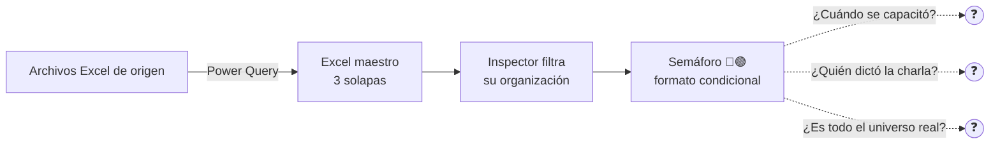
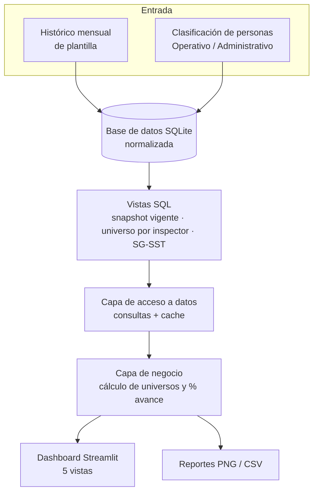
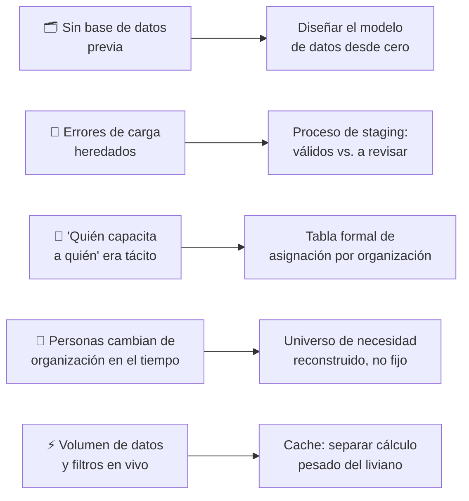
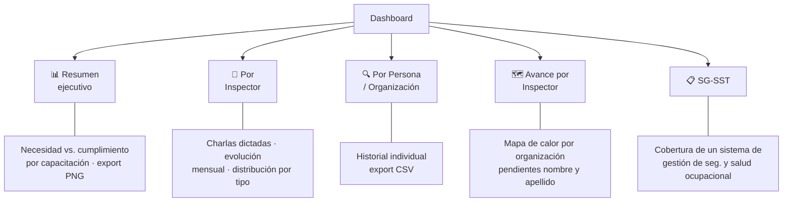
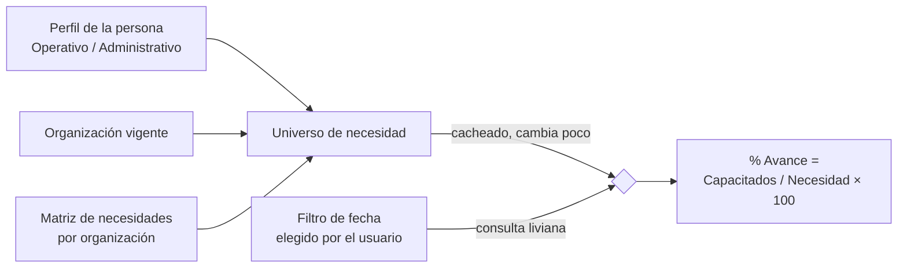

# Charla 5 Min

## Resumen Ejecutivo

Sistema de seguimiento de capacitaciones de seguridad industrial, desarrollado end-to-end: base de datos SQLite normalizada desde cero + dashboard interactivo en Streamlit.

| | Antes | Después |
|---|---|---|
| Fuente de datos | Excel + Power Query | Base de datos SQLite normalizada |
| Universo por inspector | Estimado, informal | Tabla formal, con nombre y apellido |
| Trazabilidad | Semáforo rojo/verde, sin fecha ni responsable | Registro histórico auditable |
| Consulta | Filtrar manualmente una planilla enorme | Dashboard de autoservicio, 5 vistas |
| Errores de carga | Invisibles, arrastrados por años | Detectados y auditados en el proceso de normalización |

## Contexto del Problema

**Limitaciones clave:**
- Universo de cada inspector = estimación, no dato certero (no existía tabla de asignación).
- Sin fecha ni responsable por capacitación → cero trazabilidad.
- Errores de carga heredados nunca auditados (nombres mal tipeados, duplicados).
- Jefes sin vista consolidada individual ni comparativa entre inspectores.
- Cada cambio organizativo rompía las conexiones de Power Query.

**Necesidad:** una base de datos real como fuente única de verdad, con universos formales, registro auditable y cálculo reproducible de avance.

## Objetivo de Negocio

- Base de datos relacional real, versionable y auditable — reemplazando Excel + Power Query.
- Universo exacto (nombre y apellido) por inspector, sin estimaciones.
- Cálculo de avance reproducible: mismo resultado ante la misma consulta.
- Dashboard de autoservicio para inspectores, jefes y gestión.
- Detección y corrección de errores de carga histórica.

> Como no existía ninguna métrica previa confiable, el criterio de éxito no fue "mejorar un número" sino **habilitar la posibilidad de medir por primera vez**.

## Arquitectura General

**Componentes:**
- **Base de datos SQLite** — diseñada íntegramente por mí: histórico de plantilla, clasificación de personas, matriz de necesidades por unidad, asignación formal de inspectores, registro histórico de charlas, vistas de consumo.
- **Dashboard Streamlit** — 5 vistas funcionales, filtros globales, componentes de KPI reutilizables.
- **Capa de reporting** — exportación a PNG (tablas redibujadas con Matplotlib) y CSV.

Única entrada externa: el histórico mensual de plantilla y la tabla de clasificación de personas. Todo el resto del diseño (esquema, vistas, matriz de necesidades, asignación de responsables) es autoría propia.

## Tecnologías Utilizadas

| Tecnología | Propósito |
|---|---|
| Python | Backend, lógica de negocio e interfaz |
| SQLite | Base de datos relacional embebida |
| Streamlit | Dashboard interactivo |
| Pandas | Transformación y agregación de datos |
| Plotly | Visualizaciones interactivas |
| Matplotlib | Exportación de tablas a PNG |
| NumPy | Cálculos numéricos de soporte |

## Principales Desafíos

## Solución Implementada

### Las 5 vistas del dashboard

### Cómo se calcula el avance

Separar el universo (estable, se cachea) del conteo por fecha (variable, se recalcula al vuelo) es lo que hace que mover el filtro de fechas en el dashboard sea instantáneo.

**Otros indicadores:** evolución mensual de charlas dictadas, mapa de calor organización × capacitación, listado de pendientes por inspector, cobertura del submódulo SG-SST.

**Automatizaciones:** cálculo del universo cacheado y refrescado sin intervención manual, clasificación automática de capacitaciones prioritarias, generación de reportes PNG sin captura de pantalla manual.

## Resultados Obtenidos

> No existía una línea de base confiable previa (los indicadores del Excel anterior no eran trazables), así que el foco de esta primera etapa fue **reflejar la situación real por primera vez**, no demostrar una mejora porcentual sobre una métrica inexistente.

- 🎯 **Operativo:** inspectores con universo exacto (nombre y apellido) en vez de estimación.
- 📈 **Gestión:** jefes con seguimiento individual y comparación entre inspectores — antes imposible.
- 🔎 **Analítico:** errores de carga históricos detectados vía el proceso de normalización; % de avance ahora reproducible.

## Lecciones Aprendidas

| Tipo | Aprendizaje |
|---|---|
| Técnica | Separar cálculo estable (universo) de cálculo variable (fecha) fue la decisión de mayor impacto en performance. |
| Técnica | Normalizar años de datos sin validación previa requiere un mecanismo de staging, no descartar ni forzar lo dudoso. |
| Funcional | Formalizar en una tabla lo que era "conocimiento tácito" de cada inspector tuvo más impacto percibido que cualquier gráfico. |
| Funcional | Sin métrica previa confiable, el objetivo no es "mejorar un número" sino "medir correctamente por primera vez". |
| Gestión | Construirlo en solitario dio consistencia de criterio, pero concentró todo el conocimiento del sistema en una persona — riesgo a futuro. |

## Capturas

*(Reemplazar por las capturas reales, recortadas/difuminadas para no exponer el nombre de la empresa.)*

## Próximos Pasos

- [ ] Modularizar la interfaz, separándola de la orquestación de datos.
- [ ] Diagrama completo de dependencias entre vistas SQL y funciones de carga.
- [ ] Documentar por completo la tabla de asignación de responsables por organización.
- [ ] Incorporar métricas de trazabilidad histórica una vez consolidada la situación actual.

## Disclaimer

Este caso de estudio describe conceptos, metodologías y decisiones técnicas aplicadas en un entorno corporativo.
No se incluyen datos reales, información confidencial, propiedad intelectual ni detalles sensibles de la organización donde fue desarrollado.
