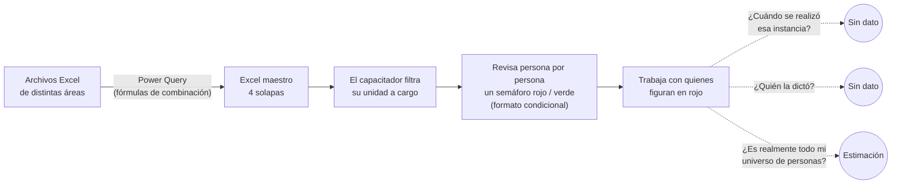
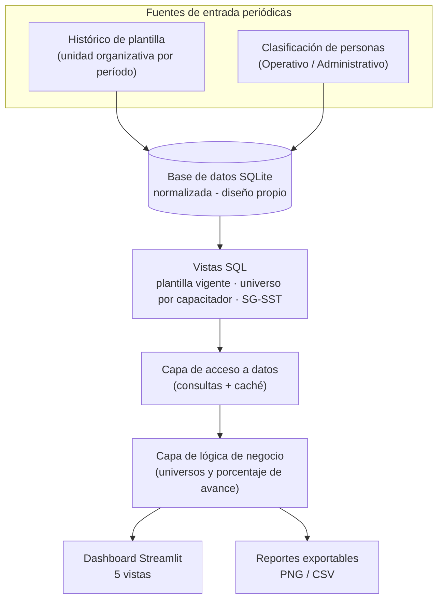
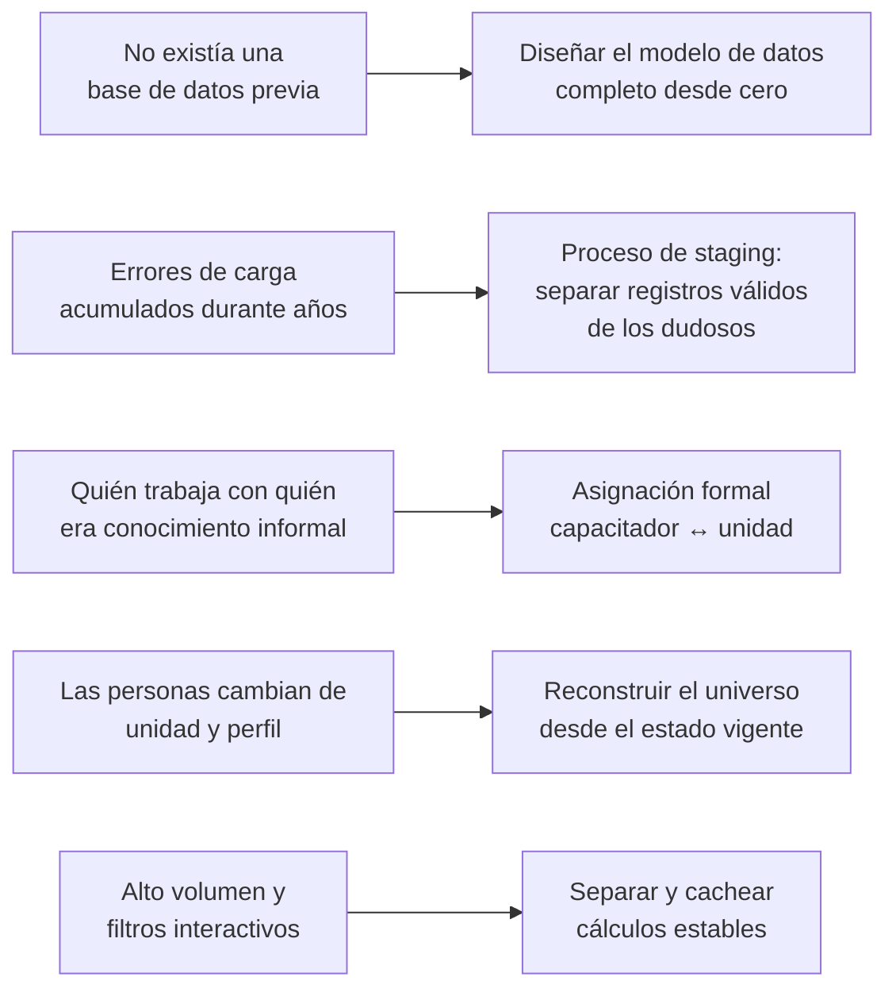
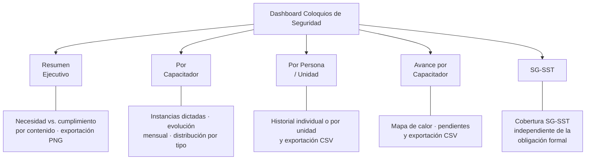
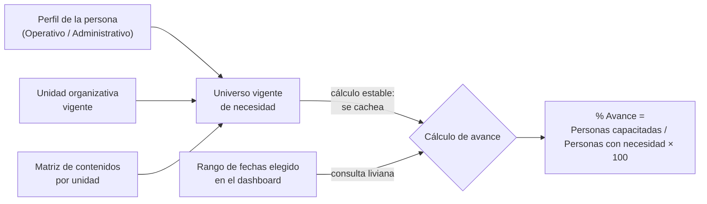
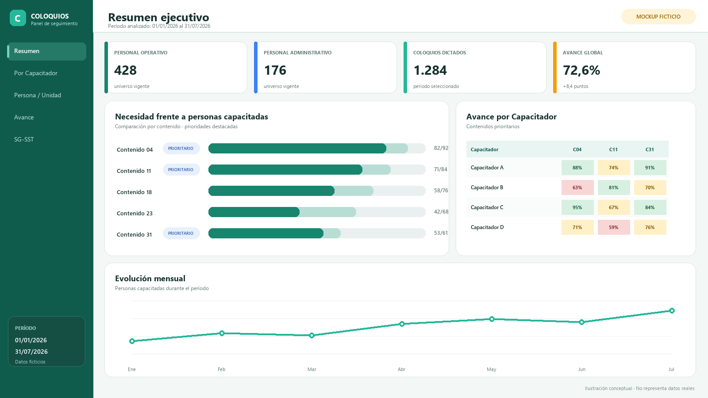
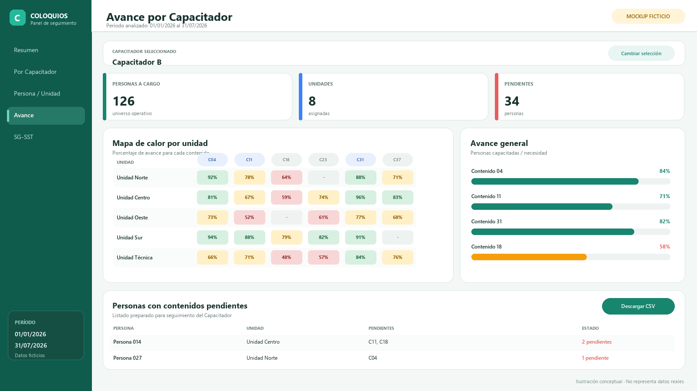
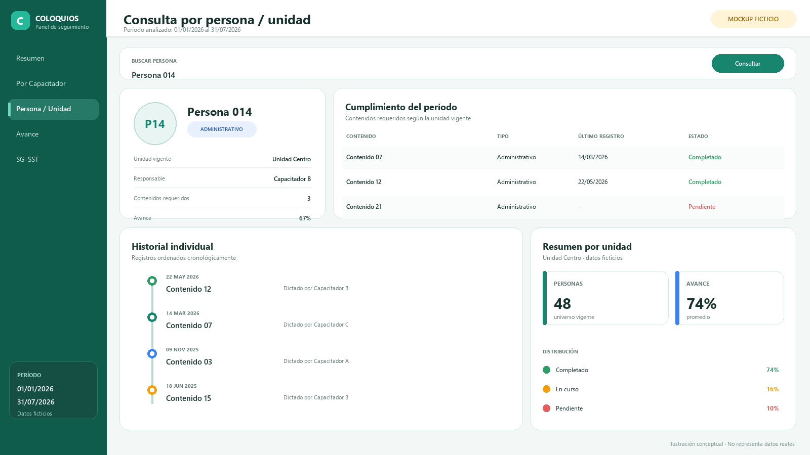
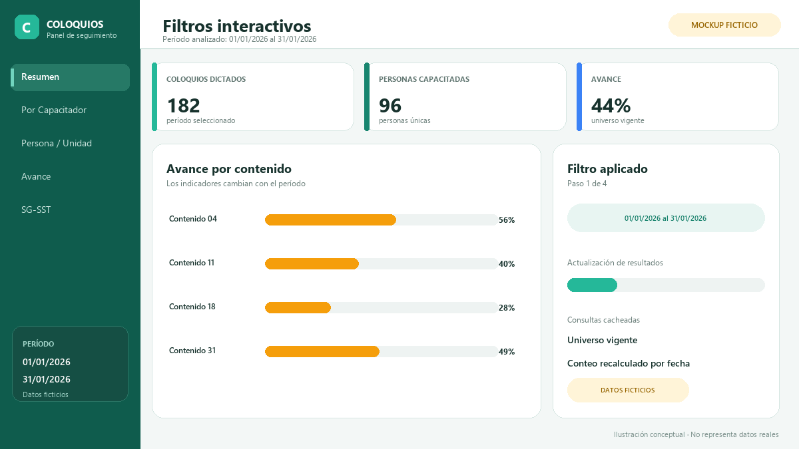

# Coloquios de Seguridad - Sistema de Seguimiento de Instancias Formativas de Seguridad Industrial

## Resumen Ejecutivo

En la empresa donde trabajo existe un programa interno de Seguridad Industrial que en este documento voy a llamar **"Coloquio Breve"**: instancias periódicas que el personal debe completar sobre contenidos específicos de su tarea. No todo el personal necesita los mismos contenidos: depende de su perfil laboral (personal de campo/operativo o de oficina/administrativo) y de la unidad a la que pertenece dentro de la organización.

El programa es dictado por un grupo de personas del área de Seguridad Industrial a quienes en este documento voy a llamar **capacitadores**: son quienes recorren las distintas unidades y desarrollan estos coloquios con el personal a su cargo.

Diseñé y desarrollé de punta a punta la solución que hoy sostiene este programa: una **base de datos SQLite construida desde cero**, que centraliza y normaliza la información, y un **dashboard interactivo en Streamlit**, que muestra quién necesita cada contenido, quién ya lo recibió y cuánto falta, de acuerdo con los filtros seleccionados.

## Contexto del Problema

### ¿Cómo se trabajaba antes de este proyecto?

Todo el seguimiento se hacía sobre un único archivo Excel, compuesto por cuatro solapas: personal operativo, personal administrativo, una matriz de contenidos requeridos por unidad organizativa y un avance estadístico de personas capacitadas frente a la necesidad. Ese Excel no leía de una base de datos: se armaba con conexiones de **Power Query** que combinaban, mediante fórmulas, otros archivos Excel de origen.

El flujo de trabajo de un capacitador era manual:


```mermaid
flowchart LR
    A["Archivos Excel<br/>de distintas áreas"] -->|"Power Query<br/>(fórmulas de combinación)"| B["Excel maestro<br/>4 solapas"]
    B --> C["El capacitador filtra<br/>su unidad a cargo"]
    C --> D["Revisa persona por persona<br/>un semáforo rojo / verde<br/>(formato condicional)"]
    D --> E["Trabaja con quienes<br/>figuran en rojo"]
    E -.->|"¿Cuándo se realizó<br/>esa instancia?"| Q1(("Sin dato"))
    E -.->|"¿Quién la dictó?"| Q2(("Sin dato"))
    E -.->|"¿Es realmente todo mi<br/>universo de personas?"| Q3(("Estimación"))
```

El capacitador filtraba manualmente la planilla por su unidad y, a partir de un semáforo rojo/verde, intentaba estimar si cada persona estaba o no capacitada. Ese semáforo no indicaba **cuándo** se había realizado la instancia ni **quién** la había dictado: solo mostraba un estado aparente, sin trazabilidad suficiente.

### Limitaciones concretas que esto generaba

- **El universo de personas de cada capacitador era una estimación, no un dato certero.** No existía una tabla que indicara formalmente qué unidad organizativa estaba a cargo de cada capacitador. Esa asignación dependía del conocimiento y la experiencia de cada persona.
- **Trazabilidad histórica insuficiente.** El semáforo mostraba un estado actual aparente, pero no permitía auditar fácilmente la fecha ni el responsable de cada instancia dictada.
- **Errores de carga heredados.** Las fórmulas de Power Query normalizaban la información hasta cierto punto, pero se arrastraban registros duplicados e inconsistencias de formato que no habían sido detectados.
- **Pérdida silenciosa de registros en el procesamiento.** A medida que creció el volumen histórico, una limitación en las consultas hizo que parte de los registros más antiguos dejara de contabilizarse, aunque continuara existiendo en los archivos de origen. El proceso no generaba alertas, por lo que el historial visible se reducía progresivamente.
- **Los jefes de área no tenían una vista consolidada.** No podían consultar con facilidad el avance de una persona ni comparar la gestión entre capacitadores. Obtener conclusiones exigía filtrar manualmente la planilla, lo que dificultaba el uso ejecutivo de la información.
- **El sistema no escalaba.** Los cambios en la estructura organizativa o en los contenidos requeridos implicaban modificar manualmente las conexiones de Power Query.
- **Lentitud del proceso.** La cantidad y el volumen de los archivos Excel generaban demoras importantes al modificar las consultas o analizar la información.
- **Personal no contemplado.** Al no existir una asignación formal entre capacitadores y unidades, parte del personal podía quedar sin un responsable claramente definido durante períodos prolongados.

### Lo que se necesitaba

Una base de datos real y normalizada, que sirviera como única fuente de verdad y permitiera:

1. Definir formalmente qué universo de personas corresponde a cada capacitador.
2. Consultar cada instancia realizada: a quién, cuándo y por quién.
3. Calcular el porcentaje de avance de forma reproducible, sin depender de fórmulas manuales.
4. Servir de base para una herramienta de consulta accesible a capacitadores, jefes de área y perfiles de auditoría.

## Objetivo de Negocio

- Reemplazar el proceso manual de Excel y Power Query por una base de datos relacional auditable, con el código fuente versionado en Git.
- Darle a cada capacitador el universo exacto, con nombre y apellido, de las personas a su cargo.
- Calcular el porcentaje de avance comparando personas con necesidad frente a personas capacitadas en un período determinado.
- Construir un dashboard de autoservicio para que cada perfil de usuario resuelva sus propias consultas.
- Detectar y corregir, durante el proceso de normalización, errores de carga histórica acumulados durante años.

> **Sobre los indicadores de éxito:** al momento de iniciar el proyecto no existía una línea de base suficientemente confiable para realizar una comparación válida. Por eso, el criterio de éxito no fue "mejorar un número existente", sino **habilitar por primera vez una medición reproducible**: que cada capacitador supiera quién tiene pendiente, que el porcentaje de avance pudiera recalcularse con las mismas reglas y que un jefe pudiera realizar seguimiento individual y comparar resultados.

## Arquitectura General

La solución se apoya en fuentes periódicas con la asignación organizativa de cada persona y su clasificación como operativa o administrativa. A partir de ellas diseñé el esquema de la base de datos, las vistas, la matriz de necesidades por unidad y la asignación formal de capacitadores.


```mermaid
flowchart TB
    subgraph Entrada["Fuentes de entrada periódicas"]
        A1["Histórico de plantilla<br/>(unidad organizativa por período)"]
        A2["Clasificación de personas<br/>(Operativo / Administrativo)"]
    end
    A1 --> DB[("Base de datos SQLite<br/>normalizada - diseño propio")]
    A2 --> DB
    DB --> V["Vistas SQL<br/>plantilla vigente · universo por capacitador · SG-SST"]
    V --> L["Capa de acceso a datos<br/>(consultas + caché)"]
    L --> N["Capa de lógica de negocio<br/>(universos y porcentaje de avance)"]
    N --> UI["Dashboard Streamlit<br/>5 vistas"]
    N --> R["Reportes exportables<br/>PNG / CSV"]
```

**Algunos de los elementos que contiene la base de datos** que diseñé y construí:

- El histórico mensual de la estructura organizativa de cada persona.
- La clasificación de cada persona en un perfil operativo, administrativo o especial.
- Una matriz de contenidos requeridos por unidad organizativa.
- Una tabla de asignación formal de capacitadores por unidad organizativa, que reemplaza el conocimiento tácito.
- El registro histórico de cada instancia dictada, incluyendo fecha, persona y capacitador responsable.
- Vistas SQL que encapsulan las combinaciones de datos más utilizadas por el dashboard.

**El dashboard**, construido en Streamlit, se organiza en cinco vistas funcionales. Las principales vistas analíticas utilizan filtros de fecha y componentes reutilizables para los indicadores.

**La capa de reporting** genera exportaciones PNG mediante tablas redibujadas con Matplotlib, pensadas para utilizarse fuera del navegador, y archivos CSV para consultas y seguimiento operativo.

### Normalización en el origen: un proyecto complementario

La calidad de la información no depende solamente del diseño de la base de datos, sino también de cómo se cargan diariamente los registros. Para resolver el problema desde el origen desarrollé un segundo proyecto, que será documentado por separado como caso de estudio, para reemplazar la inserción manual por una aplicación web con validaciones incorporadas.

Antes, registrar una instancia implicaba insertar la información sin controles automáticos de consistencia. Con esta segunda herramienta, el personal de Seguridad Industrial encargado de la carga completa un formulario guiado que:

- Valida que la persona exista y pertenezca a la unidad organizativa declarada.
- Obliga a seleccionar el contenido desde un catálogo único y normalizado, en lugar de escribirlo manualmente.
- Detecta y descarta registros duplicados.
- Escribe sobre la misma base de datos SQLite que consulta el dashboard, sin pasos intermedios.

En otras palabras: el dashboard resuelve el problema de **visualizar y medir** el cumplimiento; el proyecto complementario resuelve el problema de **cargar correctamente los datos desde el primer momento**, para evitar que la normalización dependa únicamente de correcciones posteriores.

### Estructura del proyecto

El código está organizado por responsabilidad y versionado en Git:

```text
coloquios_breves/
│
├── .streamlit/
│   └── config.toml       # Configuración visual del dashboard
├── config/
│   ├── settings.py       # Constantes de negocio y configuración central
│   └── styles.py         # Estilos de gráficos, mapas de calor y tablas
├── database/
│   ├── loaders.py        # Consultas SQL y preparación de datos con Pandas
│   └── connection.py     # Conexión SQLite utilizada por el dashboard
├── services/
│   └── avance_service.py # Lógica reutilizable para calcular avances
├── reports/
│   └── export_png.py     # Generación de reportes PNG
├── ui/
│   ├── cards.py          # Tarjetas de indicadores reutilizables
│   ├── sidebar.py        # Filtros globales
│   └── tables.py         # Tablas reutilizables
├── utils/
│   └── helpers.py        # Funciones auxiliares de formato e interfaz
├── requirements.txt      # Versiones de las dependencias
└── app.py                # Punto de entrada y navegación entre vistas
```

Esta separación es también la base del plan de modularización mencionado en "Próximos Pasos": actualmente `app.py` todavía concentra parte de la lógica de interfaz y de orquestación.

## Tecnologías Utilizadas

| Tecnología | Propósito dentro del proyecto |
|---|---|
| Python | Lenguaje principal para acceso a datos, lógica de negocio e interfaz. |
| SQLite | Motor de base de datos relacional embebido que almacena la información normalizada. |
| Streamlit | Framework utilizado para construir el dashboard interactivo. |
| Git | Control de versiones del código y la documentación técnica. |
| Pandas | Transformación y agregación de los datos leídos desde SQL. |
| Plotly | Visualizaciones interactivas: barras, series temporales y mapas de calor. |
| Matplotlib | Generación de tablas exportables en PNG. |

## Principales Desafíos


```mermaid
flowchart LR
    D1["No existía una<br/>base de datos previa"] --> S1["Diseñar el modelo de datos<br/>completo desde cero"]
    D2["Errores de carga<br/>acumulados durante años"] --> S2["Proceso de staging:<br/>separar registros válidos<br/>de los dudosos"]
    D3["Quién trabaja con quién<br/>era conocimiento informal"] --> S3["Asignación formal<br/>capacitador ↔ unidad"]
    D4["Las personas cambian de<br/>unidad y perfil"] --> S4["Reconstruir el universo<br/>desde el estado vigente"]
    D5["Alto volumen y<br/>filtros interactivos"] --> S5["Separar y cachear<br/>cálculos estables"]
```

- **No existía una base de datos previa:** tuve que definir desde cero qué tablas eran necesarias, cuáles debían ser históricas y cuáles de catálogo o clasificación, además de sus relaciones.
- **Errores de carga históricos:** durante la migración aparecieron variaciones de tipeo, registros duplicados y datos que no coincidían con el catálogo oficial. Construí un proceso de validación que separa los registros válidos de los dudosos para revisarlos antes de incorporarlos a la base definitiva.
- **Formalizar quién trabaja con quién:** no existía una tabla que asignara explícitamente qué capacitador era responsable de cada unidad organizativa. Relevé esa información y la modelé para convertir un conocimiento informal en un dato consultable.
- **Calcular el avance con una estructura cambiante:** las personas pueden cambiar de unidad y perfil. En la versión actual, el universo de necesidad se reconstruye utilizando la asignación organizativa vigente, mientras que las instancias realizadas se filtran por el período seleccionado. La trazabilidad histórica de las necesidades se mantiene como una mejora futura.
- **Rendimiento sobre un volumen considerable:** los históricos acumulan decenas de miles de registros. Separé el cálculo estable del universo, cacheado por períodos más largos, de las consultas variables por fecha, que son más livianas.

## Solución Implementada

### Las cinco vistas del dashboard


```mermaid
flowchart TD
    APP["Dashboard Coloquios de Seguridad"] --> T1["Resumen<br/>Ejecutivo"]
    APP --> T2["Por<br/>Capacitador"]
    APP --> T3["Por Persona<br/>/ Unidad"]
    APP --> T4["Avance por<br/>Capacitador"]
    APP --> T5["SG-SST"]

    T1 --- T1d["Necesidad vs. cumplimiento<br/>por contenido · exportación PNG"]
    T2 --- T2d["Instancias dictadas · evolución<br/>mensual · distribución por tipo"]
    T3 --- T3d["Historial individual o por unidad<br/>y exportación CSV"]
    T4 --- T4d["Mapa de calor · pendientes<br/>y exportación CSV"]
    T5 --- T5d["Cobertura SG-SST<br/>independiente de la<br/>obligación formal"]
```

- **Resumen ejecutivo:** vista general del programa: personas operativas y administrativas con necesidad, personas capacitadas, comparación por contenido, identificación visual de prioridades configuradas y reportes PNG. También incluye una tabla exportable con el avance de cada capacitador en los contenidos prioritarios.
- **Vista por capacitador:** permite analizar la gestión de cada capacitador: cantidad de coloquios dictados, personas capacitadas, evolución mensual y distribución por tipo de contenido.
- **Vista por persona / unidad:** permite consultar el historial de una persona o de una unidad completa, sus contenidos requeridos y el cumplimiento dentro del período seleccionado, con exportación CSV.
- **Avance por capacitador:** cruza el universo formal de personas asignadas con los contenidos requeridos. Incluye gráficos de avance, mapa de calor por unidad, detalle de personas capacitadas y pendientes, y una lista exportable a CSV para enviar a cada capacitador.
- **SG-SST:** identifica quién recibió al menos una instancia asociada al Sistema de Gestión de Seguridad y Salud en el Trabajo, sin depender de que exista una obligación formal registrada para esa persona.

Las vistas analíticas principales comparten un filtro global de fechas y componentes reutilizables, para mantener consistencia visual y de comportamiento. La vista SG-SST utiliza su propio universo consolidado.

### Cómo se calcula el porcentaje de avance

La fórmula es simple, pero la construcción de cada término requiere combinar distintas fuentes:


```mermaid
flowchart LR
    P["Perfil de la persona<br/>(Operativo / Administrativo)"] --> U["Universo vigente<br/>de necesidad"]
    O["Unidad organizativa<br/>vigente"] --> U
    M["Matriz de contenidos<br/>por unidad"] --> U
    U -->|"cálculo estable:<br/>se cachea"| C{"Cálculo de avance"}
    F["Rango de fechas elegido<br/>en el dashboard"] -->|"consulta liviana"| C
    C --> PCT["% Avance =<br/>Personas capacitadas / Personas con necesidad × 100"]
```

El **universo de necesidad** se reconstruye combinando el perfil de la persona, su unidad organizativa vigente y la matriz de contenidos por unidad. Es un cálculo relativamente estable, por lo que se cachea. El **conteo de personas capacitadas** depende del rango de fechas seleccionado y se resuelve mediante consultas más livianas. Esta separación permite actualizar los indicadores sin reconstruir el universo completo en cada interacción.

> La necesidad representa el estado organizativo vigente, incluso cuando se consulta un período histórico. Incorporar una matriz histórica de necesidades forma parte de los próximos pasos.

**Otros indicadores generados:** evolución mensual de coloquios dictados, mapa de calor de unidad organizativa por contenido, listado de personas pendientes por capacitador y cobertura del módulo SG-SST.

**Automatizaciones incorporadas:** cálculo cacheado del universo de necesidad, actualización periódica de consultas, identificación de contenidos prioritarios desde una configuración central y generación de reportes PNG sin capturas de pantalla manuales.

## Resultados Obtenidos

> La empresa no contaba con una línea de base numérica suficientemente confiable para realizar una comparación directa. Por eso, el foco de esta etapa estuvo puesto en reflejar la situación de manera reproducible, no en demostrar una mejora frente a una métrica previa que no podía validarse adecuadamente.

- **Beneficio operativo:** cada capacitador dejó de trabajar con una estimación informal y ahora puede identificar, con nombre y apellido, quién debe completar cada contenido y quién está pendiente.
- **Beneficio de gestión:** los jefes de área pueden realizar seguimiento individual y comparar los resultados entre distintos capacitadores.
- **Beneficio analítico:** la normalización permitió detectar errores de carga que antes pasaban inadvertidos dentro de las fórmulas de Excel y habilitó un cálculo reproducible del porcentaje de avance.
- **Beneficio estadístico:** ahora es posible comparar anualmente los avances, analizar qué competencias deberían haberse alcanzado y desarrollar análisis más complejos sobre el impacto de estas instancias frente a los accidentes. Esto permite estudiar posibles disminuciones estacionales y revisar la prioridad de los contenidos según las distintas etapas del año.

## Lecciones Aprendidas

| Tipo | Aprendizaje |
|---|---|
| Técnica | Separar el cálculo estable del universo del conteo variable por fecha fue la decisión que más impactó en el rendimiento del dashboard. |
| Técnica | Normalizar años de datos sin validaciones previas requiere un mecanismo de staging, en lugar de descartar o forzar los registros dudosos. |
| Funcional | Formalizar en una tabla qué unidades tiene a cargo cada capacitador tuvo más impacto percibido que cualquier gráfico. |
| Funcional | Cuando no existe una métrica previa confiable, el objetivo debe ser establecer una medición correcta antes de intentar demostrar una mejora. |
| Gestión | Construir la base de datos y el dashboard en solitario dio consistencia a las reglas de negocio, pero también concentró el conocimiento del sistema en una sola persona. |

## Capturas y Mockups

Las siguientes ilustraciones reproducen las funciones principales con **datos completamente ficticios**. No son capturas del entorno productivo y no contienen nombres, métricas ni información real de la organización.









## Próximos Pasos

- [ ] Modularizar la interfaz del dashboard y separar la orquestación de datos. Actualmente `app.py` concentra cerca de 1500 líneas y todavía combina responsabilidades de interfaz y coordinación.
- [ ] Generar el diagrama completo de dependencias entre vistas SQL y funciones de carga.
- [ ] Incorporar un histórico de necesidades para conocer la unidad y los contenidos requeridos de cada persona en el momento exacto de cada registro.
- [ ] Crear un entorno virtual con `uv`, con versiones específicas de las dependencias y ejecución aislada del entorno global de Python.

## Disclaimer

Este caso de estudio describe conceptos, metodologías y decisiones técnicas aplicadas en un entorno corporativo. El nombre del programa fue reemplazado y algunos detalles operativos fueron reducidos o adaptados para preservar la confidencialidad.

No se incluyen datos reales, información confidencial, propiedad intelectual ni detalles sensibles de la organización. Todas las personas, unidades, cifras y visualizaciones utilizadas en los mockups son ficticias.
