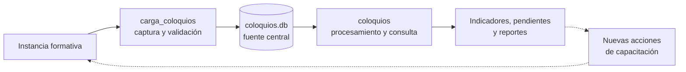

# Pipeline de Coloquios

## Resumen ejecutivo

Este caso de estudio describe cómo se conectan tres desarrollos para sostener el seguimiento de coloquios e instancias formativas de Seguridad Industrial: una aplicación de carga, una base de datos central y un dashboard de consulta.

El proceso comienza cuando una persona registra una actividad mediante `carga_coloquios`. La información se valida y se almacena en `coloquios.db`. Luego, `coloquios` consulta esa misma fuente, aplica las reglas de negocio y transforma los registros en indicadores de necesidad, cumplimiento y pendientes.

La idea original y el primer boceto de `carga_coloquios` fueron desarrollados por [saguirre-e](https://github.com/saguirre-e). A partir de esa propuesta continué iterando la herramienta, ampliando su flujo de validación e integrándola con la base de datos y el sistema de seguimiento.

El resultado es un pipeline que vincula la operación diaria con la gestión: lo que se registra durante la carga termina alimentando los tableros utilizados para analizar el avance y orientar nuevas acciones.

## Contexto

Contar con una base de datos y un dashboard no resolvía por sí solo todo el problema. También era necesario controlar cómo ingresaban los nuevos registros.

Si una misma instancia podía escribirse con nombres diferentes, asociarse a una persona incorrecta o cargarse más de una vez, esas inconsistencias terminaban trasladándose a los indicadores. Corregirlas posteriormente era posible, pero implicaba revisar información que ya había recorrido todo el proceso.

Por eso se incorporó una aplicación específica para la carga. Su función es aplicar criterios comunes desde el origen y asegurar que tanto quienes registran actividades como quienes consultan resultados trabajen sobre la misma información.

## Funcionamiento del pipeline

### `carga_coloquios`

Es el punto de entrada operativo. Permite seleccionar personas, capacitadores y contenidos desde valores previamente definidos, revisar la información antes de confirmarla y registrar varias participaciones dentro de una misma carga.

La aplicación consulta en `coloquios.db` la plantilla vigente y los catálogos que necesita para construir los formularios. Después de validar la entrada, escribe los registros en los históricos correspondientes. De esta manera, no mantiene una copia propia de la información ni utiliza archivos intermedios.

### `coloquios.db`

Es el punto de integración entre los sistemas. Centraliza los registros históricos, los catálogos, la plantilla y las reglas necesarias para construir los universos de seguimiento.

La aplicación de carga la utiliza para leer valores válidos y guardar nuevas actividades. El dashboard la utiliza como fuente de consulta. Ambas aplicaciones se relacionan a través de la base de datos y no mediante una comunicación directa entre ellas.

El diseño y las reglas internas de esta capa se encuentran documentados por separado en [Coloquios.db - Modelado de datos en SQLite](https://github.com/jminolli-e/case-studies/tree/main/coloquios.db).

### `coloquios`

Es la capa analítica del pipeline. Consulta la base sin modificarla, combina las actividades realizadas con la plantilla vigente y las necesidades definidas para cada unidad organizativa, y calcula los indicadores de cumplimiento.

La información se presenta mediante un dashboard con filtros, gráficos, listados de personas pendientes y reportes exportables. Su funcionamiento y sus reglas de cálculo se describen con mayor detalle en [Coloquios de Seguridad](https://github.com/jminolli-e/case-studies/tree/main/coloquios).

## Por qué SQLite

La elección de SQLite respondió principalmente a las restricciones de infraestructura disponibles. El área no contaba con un servidor donde instalar y administrar SQL Server u otro motor equivalente, ni con presupuesto aprobado para contratar una base administrada en la nube.

Técnicamente era posible instalar SQL Server en una computadora de trabajo y exponerlo dentro de la red. Sin embargo, eso habría convertido una estación de trabajo en un servidor improvisado. La disponibilidad dependería de que el equipo permaneciera encendido y conectado, y cualquier reinicio, actualización o falla afectaría a todos los usuarios. El motor también competiría por memoria, procesamiento y disco con el uso habitual de una computadora que no fue dimensionada para funcionar como servidor.

Esa alternativa habría requerido, además, administrar conexiones de red, permisos, firewall, credenciales, copias de seguridad y recuperación ante fallas sin disponer de infraestructura ni soporte dedicado. Una solución web alojada externamente también fue evaluada, pero las opciones gratuitas no resultaban adecuadas para el volumen, las consultas y las conexiones esperadas, mientras que no existía disposición para contratar un servicio pago.

SQLite permitió avanzar con una solución portable, sin un proceso servidor y con integración directa con Python. Para el patrón actual, compuesto principalmente por consultas de lectura y escrituras concentradas en procesos controlados, resultó una alternativa suficiente y sostenible.

La decisión también tiene límites. SQLite permite múltiples lectores, pero serializa las escrituras. SQL Server u otro motor con servidor sería más apropiado si crecieran significativamente la concurrencia, la frecuencia de carga o la cantidad de aplicaciones consumidoras. La elección no representa una equivalencia técnica entre ambos motores, sino una solución pragmática para el contexto disponible.

## Por qué es un pipeline

Cada componente recibe y prepara información que necesita el siguiente:

1. `carga_coloquios` captura y valida los datos.
2. `coloquios.db` los conserva y los relaciona con el resto de la información.
3. `coloquios` los transforma en indicadores y herramientas de seguimiento.
4. Los resultados permiten identificar pendientes y planificar nuevas actividades.

No se trata de un proceso completamente automatizado: las cargas son confirmadas por usuarios y el dashboard se consulta de manera interactiva. Aun así, existe un recorrido definido del dato, responsabilidades separadas y una dependencia clara entre las salidas y entradas de cada etapa. Por ese motivo, en este documento se lo describe como un pipeline.

## Resultado

La vinculación de los tres componentes permitió que la carga y el análisis dejaran de ser procesos aislados. Los registros se incorporan con criterios comunes, quedan disponibles en una fuente central y pueden utilizarse para recalcular los indicadores de forma reproducible.

El principal valor del pipeline no está en una tecnología particular, sino en la continuidad entre la actividad realizada, su registro y el seguimiento posterior. Esa conexión permite detectar personas pendientes, comparar avances y utilizar la información para orientar las siguientes acciones del programa.

## Disclaimer

Este caso de estudio describe conceptos, decisiones y relaciones entre sistemas desarrollados en un entorno corporativo. Los nombres fueron adaptados y se omitieron rutas internas, datos productivos e información sensible de la organización.
